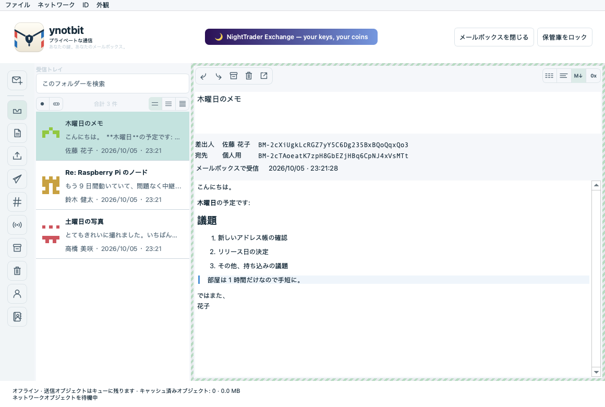
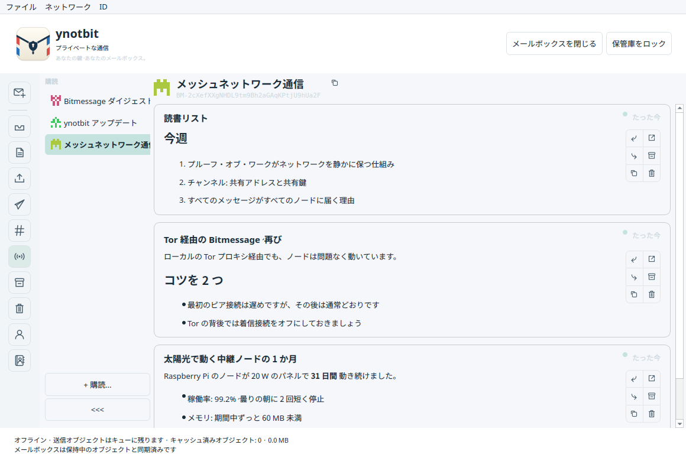
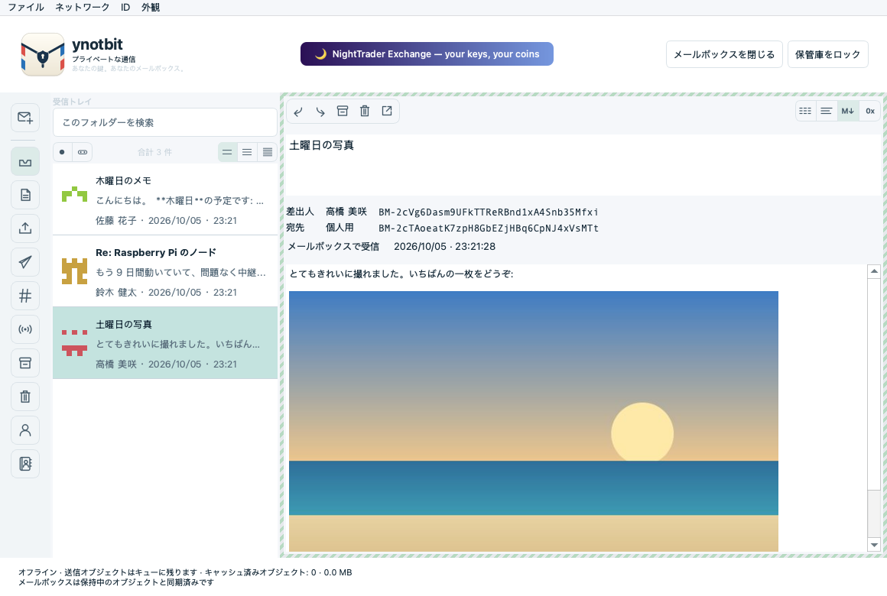
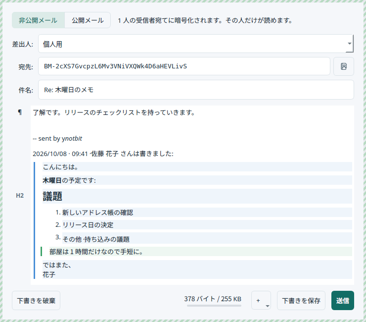
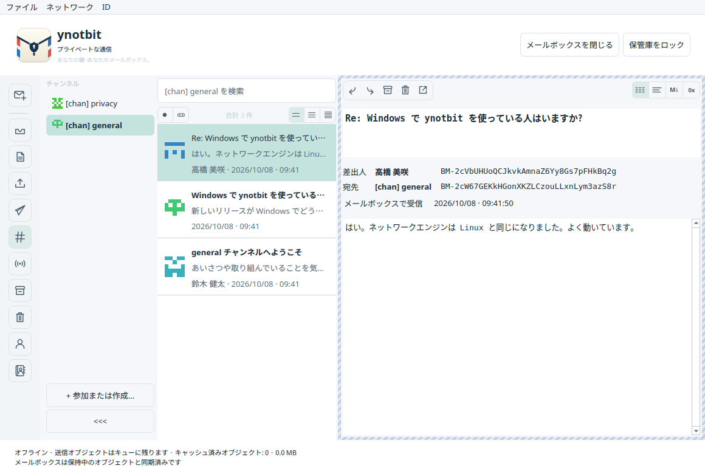
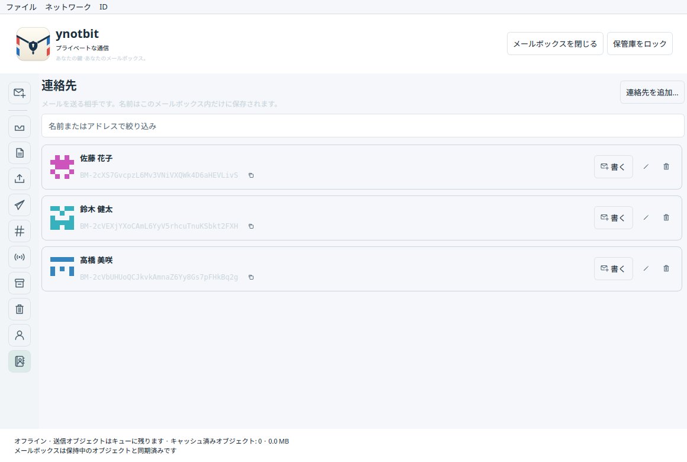
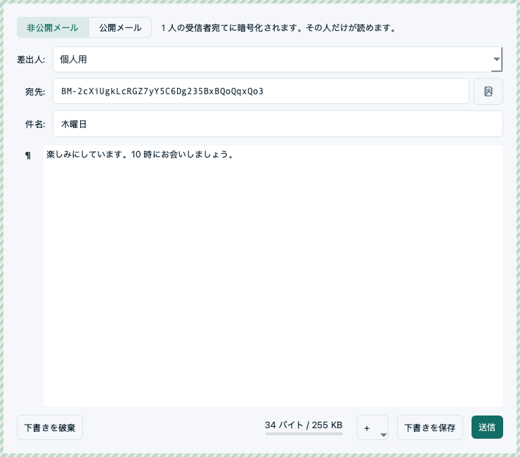

# ynotbit — why not bit?

[English](README.md) | **日本語**

[notbit](https://github.com/bpeel/notbit) をベースにした、コンパクトなデスクトップ版 Bitmessage
クライアントです。作者は [yshurik](https://github.com/yshurik)。**現在のリリース: 0.6.0**

ynotbit は ID の鍵をパスワードで保護された保管庫に、やり取りしたメールを別の暗号化された
メールボックスに保存します。鍵を持たないリレーは、保管庫がロックされている間もネットワーク
オブジェクトを集め続けます。ロックを解除すると、保持していたオブジェクトを検査し、自分宛ての
メールをメールボックスに保存します。



| 購読 | メールの中の画像 | 返信 |
|---|---|---|
|  |  |  |

| チャンネル | 連絡先 | 連絡先にメールを書く |
|---|---|---|
|  |  |  |

## ダウンロード

[**v0.6.0 リリース**](https://github.com/yshurik/ynotbit/releases/tag/v0.6.0) — Linux (x86_64)、
macOS (Apple Silicon)、Windows (x86_64) 向けの、ビルド済みで CI テスト済みのパッケージです。
各ビルドが保証すること・しないことは、下の[現在の制限](#現在の制限)を参照してください。

画面はシステムの言語が日本語なら日本語で表示されます。**外観 → 言語** で選ぶこともできます
(再起動後に適用)。

## 使い方

1. `.bmvault` ファイルを作成するか開きます。ID を作成するか、`keys.dat` をインポートするか、
   共有フレーズと期待されるアドレスを入力してチャンネルに参加します。
2. 書類フォルダーなど書き込みできる場所に `.bmmail` ドキュメントを作成するか開きます。
3. **メールを書く** を選び、差出人を選んで宛先を指定します。連絡先の名前か BM- アドレスを
   入力するか、**宛先** の横の連絡先ボタンを使います。変更は暗号化されたメールボックスに
   自動で保存されます。
4. **送信** を選びます。保存済みの下書きには **編集 / 送信** があります。
5. 進み具合は **送信トレイ** で確認します。鍵の取得やプルーフ・オブ・ワークには時間が
   かかることがあります。受信者の受領確認は非同期で届き、既読通知ではありません。
6. 使い終わったら保管庫をロックします。準備は一時停止し、メールボックスは閉じられますが、
   リレーはすでに渡された暗号化ネットワークオブジェクトの処理を続けます。

相手に名前を付けるには、メールの中のアドレスの横にある人型とプラスのボタンをクリックするか、
**連絡先 → 連絡先を追加…** を使います。名前はメッセージ一覧、閲覧画面、作成画面に表示され、
常に完全なアドレスと並んで表示されます。

送信者のブロードキャストをフォローするには、**購読** を開いて **+ 購読…** を選びます
(または **ID → ブロードキャストを購読…**)。投稿はフィードとして表示されます。新しい
メールボックスは、最初から Bitmessage ダイジェストと ynotbit のアップデート通知を購読しています。

メールに画像を入れるには、作成画面の **+** ボタンか右クリックメニューを使うか、画像ファイルを
メールにドロップします。

**ファイル → メールボックスと保管庫をバックアップ…** で両方のドキュメントを保存できます。
必ず両方を保管してください。メールボックスだけでは、その暗号鍵を復元できません。パスワードを
変更しても、古い保管庫のコピーやバックアップは無効になりません。インポートしても元の平文の
`keys.dat` はそのまま残ります。

## 機能

- 持ち運べる保管庫: Argon2id (64 MiB、3 パス) と XChaCha20-Poly1305。保護されたメモリでの
  鍵の確保、パスワードの変更、ID の名前、決定的な v3/v4 チャンネル。
- SQLCipher のメールボックス: 下書き、本文、アドレス、公開鍵、配信記録、受領確認トークン、
  購読、チェックポイントはすべて暗号化されたままです。既存の v1 メールボックスは、下書きを
  失わずにトランザクションで移行されます。
- 受信者の公開鍵による送信、v2/v3/v4 の公開鍵の要求と応答、キャンセルできるバックグラウンドの
  プルーフ・オブ・ワーク (CPU の 1 コアを除くすべてのコアと、GPU で計算。GPU は macOS では
  Metal、それ以外では OpenCL)、永続的な送信トレイと配信履歴。
- ダイレクトメッセージの復号と送信者の検証、受領確認、回数に上限のある期限切れ時の自動再送、
  手動の再送とキャンセル、認証済みの送信者の鍵を使った返信。キャンセルしても、すでに
  リレーされたオブジェクトは取り消せません。
- アドレス帳: 連絡先にはこのメールボックスだけの非公開の名前を付けられ、暗号化された
  メールボックスに保存されて、送信されることはありません。どのメールからもワンクリックで
  追加でき、一覧・閲覧画面・作成画面 (名前での補完と連絡先の選択) に名前が表示されます。
  完全なアドレスは常に名前の横に表示されたままです。
- チャンネルには名前付きの選択欄があり (参加したチャンネルは PyBitmessage と同じく
  `[chan] <フレーズ>` という名前になります)、メッセージ一覧と検索はチャンネルごとに分かれ、
  **チャンネルに書き込む** 操作があります。チャンネル一覧は、未読の印が付いたアイデンティコンの
  列に折りたためます。BM- アドレスは等幅フォントで表示され、アドレスごとに GitHub 風の
  アイデンティコンが付きます。
- 閲覧画面はメールを種類 (個人宛て、チャンネル内の個人宛て、匿名のチャンネル投稿、
  ブロードキャスト) ごとに枠で区別し、プレーンテキスト、テキスト、Markdown、16 進で表示できます。
  Markdown と読めないバイナリは自動で判別します。
- メッセージの詳細は差出人と宛先のアドレスを揃えて表示し、受領確認が届いたことを色で示し、
  記録された配信の経過 (準備、鍵の取得、ピアに送信、受領確認、メールボックスで受信) を表示します。
- ブロードキャストの公開 (v4/v5 オブジェクト) と **購読**: フォロー中の送信者をチャンネル一覧と
  同じような列に並べ、送信者ごとの投稿をカードのフィードとして表示します。カードからは
  個別に返信、転送、テキストをコピー、新しいウィンドウで開く、アーカイブ、ゴミ箱に移動が
  できます。新しいメールボックスは Bitmessage ダイジェストを購読しています。共有チャンネル、
  バックグラウンドで実行されるフォルダー検索、既読状態、アーカイブ、ゴミ箱と復元、明示的な
  完全削除。
- アップデート通知: ynotbit のリリースアドレス (`BM-2666hf5eAbjCJMaPwC7eG3Um55QJGM`) からの
  署名付きブロードキャストで、購読しなくても新しいバージョンが出るとバナーで知らせます。
  **ネットワーク → ynotbit の新しいバージョンを通知** でオフにできます。
- 別プロセスの notbit リレーは Linux、macOS、Windows で動作し、保管庫やメールボックスの鍵は
  一切受け取りません。ピアには `/ynotbit:<バージョン>/` と名乗ります。上限のあるローカルの
  キューでネットワークオブジェクトを受け付け、プルーフ・オブ・ワークを検証し、受理・拒否・
  接続中のピアへの提供を記録します。受信の状態は再起動しても残ります。
- ネットワークオブジェクトは 1 つの SQLite ファイル `objects.sqlite` に保存されます。リレーが
  書き込んで保持期間の上限に合わせて整理し、アプリが読み取るので、新しいオブジェクトは次の
  更新でメールボックスに届きます。
- デスクトップは QML や Qt Quick を使わない Qt Widgets 製です。描画されるリストが保持する
  メッセージの概要は 100 件のページで最大 3 ページまでで、本文は選んだメールのものだけを
  読み込みます。
- 作成画面はビジュアルな Markdown エディターです。各段落の横の記号 (¶、H1–H6、リスト、
  コード) から、MarkText のように **変換** を開けます。返信では元のメールを同じエディターの
  中に `>` でメール風に引用します。引用した文は編集できますが引用のまま残り、閲覧画面では
  引用の深さを色付きの線で示します。メールは転送もできます。
- Bitmessage には添付ファイルがないため、画像は標準的な Markdown の `data:` URL としてメールの
  中に入れて送り、1 通に収まるよう縮小します。閲覧画面は PyBitmessage のインライン画像も
  表示します。読み込むのは PNG、JPEG、GIF、WebP だけです。表示するメッセージには、
  ローカルファイルやリモートの画像を読み込まない安全な Markdown ドキュメントを使います。
  外観は既定でシステムの配色に従い、ライトかダークにも設定できます。
- 画面は英語、簡体字中国語、繁体字中国語、日本語、韓国語、ロシア語、ウクライナ語に対応して
  います。システムの言語に従うほか、**外観 → 言語** で選ぶこともできます (再起動後に適用)。
  日付は選んだ言語の形式で表示されます。
- ピア数、オフラインモード、ノードの再起動、追加のピアと SOCKS5 プロキシの設定、
  ネットワークキャッシュの保持期間の設定、最近使ったドキュメント、まとめてのバックアップ。

配信の状態は **キュー待ち → 受信者の鍵を待機中 → 受領確認を準備中 → プルーフ・オブ・ワーク →
ピアに提供済み → 受領確認を待機中 → 受領確認済み** と区別されます。ブロードキャストと
チャンネルのメッセージは、受信者の受領確認なしで **公開済み** として完了することがあります。
ピアへの提供は、すべてのピアや最終的な受信者が受け取ったことの証明ではありません。

## ビルドとテスト

必要なもの: CMake 3.22 以上、C++20、Qt 6.8 以上 (Core、Gui、Widgets、Network、Test)、OpenSSL、
libsodium、SQLCipher、pkg-config、Ninja。ループバックのリレーテストには Python 3 を使います。
固定バージョンのストレージ依存ライブラリをソースからビルドする場合は、Autoconf、Automake、
make、Tcl も必要です。

```sh
scripts/build-dependencies.sh /absolute/scratch /absolute/deps
export PKG_CONFIG_PATH=/absolute/deps/lib/pkgconfig
cmake -S . -B build -G Ninja \
  -DCMAKE_PREFIX_PATH=/absolute/Qt/6.8.3/macos \
  -DCMAKE_BUILD_TYPE=Release
cmake --build build --parallel 4
ctest --test-dir build --output-on-failure
```

Linux では Qt の `gcc_64` ディレクトリを使います。実行ファイルのターゲットは `ynotbit` で、
macOS では `ynotbit.app` ができます。テストは一時的なドキュメントとループバックのピアを使い、
公開ネットワークのメッセージは使いません。独立したワイヤーフィクスチャは、Python cryptography
50.0.1 と `tests/generate_wire_fixtures.py` で再生成できます。通常のテストにこのパッケージは
不要です。

Windows では MSVC と Ninja でビルドします。OpenSSL、libsodium、SQLCipher は
`build-dependencies.sh` の代わりに [vcpkg](https://github.com/microsoft/vcpkg) (`vcpkg.json`
マニフェスト、`x64-windows` トリプレット) で取得し、
`-DCMAKE_TOOLCHAIN_FILE=<vcpkg>/scripts/buildsystems/vcpkg.cmake` を渡します。3 つの
プラットフォームすべてについて、CI で検証済みの正確な手順は `.github/workflows/release.yml` に
あります。

翻訳は `translations/ynotbit_<lang>.ts` にあり、Qt Linguist や任意のテキストエディターで編集
できます。画面に表示される文字列をコードで変更したら、`cmake --build build --target
update_translations` を実行してファイルを更新します。`scripts/check-translations.py` (テストでも
あります) は、未翻訳の項目や壊れた `%1` プレースホルダーがあると失敗します。ストレージ層と
プロトコル層のエラーメッセージは `scripts/update-error-catalog.py` が集めます。

README のスクリーンショットは実際のメールボックスではなくデモデータから作られます。
`cmake --build build --target readme_screenshots` でビルドし、日本語版は
`QT_QPA_PLATFORM=offscreen build/readme_screenshots docs/images/ja ja` で再生成できます。

Qt のランタイムライブラリを同梱した配布用パッケージを作るには:

```sh
# macOS
scripts/package-macos.sh /absolute/build /absolute/ynotbit-macos-arm64.zip /absolute/Qt/6.8.3/macos
# Linux — linuxdeploy で自己完結した AppImage を 1 つ作ります
scripts/package-linux.sh /absolute/build /absolute/ynotbit-x86_64.AppImage /absolute/Qt/6.8.3/gcc_64
```
```powershell
# Windows
scripts/package-windows.ps1 -BuildDir C:\absolute\build -OutputZip C:\absolute\ynotbit-windows-x86_64.zip `
  -QtBinDir C:\absolute\Qt\6.8.3\msvc2022_64\bin -VcpkgBinDir C:\absolute\build\vcpkg_installed\x64-windows\bin
```

## ドキュメント、ネットワークデータ、移植性

保管庫とメールボックスのドキュメントは好きな場所に置けます。ノードとキャッシュのフォルダーは
Qt のアプリケーションデータの場所を使います。内部のアプリケーション識別子は、以前のアルファ版の
キャッシュとの互換性のため `NotbitDesktop/Notbit Desktop` のままです。`--data-dir /absolute/path`
でノードのフォルダーを変更できます。`--portable` は起動したディレクトリからの相対パス
`./notbit-data/node` を使います。`--offline` はネットワークに接続せずに起動します。リレーは
アプリの終了とともに停止します。

ネットワークの保持期間の既定は 2 GiB / 90 日で、ノードのフォルダーにある `objects.sqlite` で
リレーが管理します。**ネットワーク → 保持期間の設定…** で変更できます。ローカルでの保持は
プロトコル上の有効期限より長くでき、あとでロックを解除してから検査できます。保持していた
オブジェクトを破棄すると、あとから復元できなくなることがありますが、すでにメールボックスに
保存されたメールには影響しません。プルーフ・オブ・ワークは CPU の 1 コアを除くすべてのコアと、
GPU があれば GPU も使います。`YNOTBIT_NO_GPU=1` を設定すると CPU だけで計算します。

## 現在の制限

これはまだ開発中のソフトウェアです。ローカルのテストは、ドキュメントの移行、不正な
オブジェクト、プロトコルのフィクスチャ、実際のプルーフ・オブ・ワーク、コントローラーの配信、
ロックと再オープン、デスクトップの操作、実際のループバックのリレーでの公開をカバーしています。
これは独立したセキュリティ監査でも、公開ネットワークでの相互運用性の認証でもありません。
ロックすると保護された鍵は解放されアクセスは閉じられますが、表示された平文の Qt や OS による
コピーが、メモリ、スワップ、クラッシュダンプ、スクリーンショットのすべてから消去されることは
保証されません。

macOS 用のパッケージは **Apple Silicon、macOS 15.6 以降** が対象で、実行時の依存ライブラリを
同梱しています。アドホック署名のみで、Developer ID による署名や公証は受けていません。0.5.0
からは Windows 版でも、小さな Winsock 層 (`third_party/notbit/src/ntb-win32.c`) を通して notbit
エンジンが動きます。Windows にはアプリからノードをきれいに停止させるシグナルがないため、
終了時にノードは強制終了され、ストアがキューに入れたままでまだ書き込んでいない処理は失われます。
Linux 版のダウンロードは AppImage 1 つです。添付ファイル (メールの中に入れて送る画像を除く) と、
CPU の並列度の設定は実装されていません。

`.github/workflows/release.yml` は、`v*` タグのプッシュ (または手動実行) のたびに Linux、macOS、
Windows をビルド・テスト・パッケージ化し、3 つのアーカイブを GitHub Release に添付します。
`docs/ci/build.yml` は、より軽い継続的ビルドとテストのワークフロー (すべてのプッシュと PR、
パッケージ化なし) の古い未使用のテンプレートで、まだ `.github/workflows/` には組み込まれていません。

[検証](docs/verification.md)、[アーキテクチャ](docs/design.md)、
[実装計画](docs/superpowers/plans/2026-09-13-complete-messaging.md)、
[サードパーティの帰属表示](THIRD_PARTY.md) もご覧ください (いずれも英語)。ynotbit 独自の
コードは MIT ライセンスです。同梱のコンポーネントはそれぞれのライセンスに従います。
