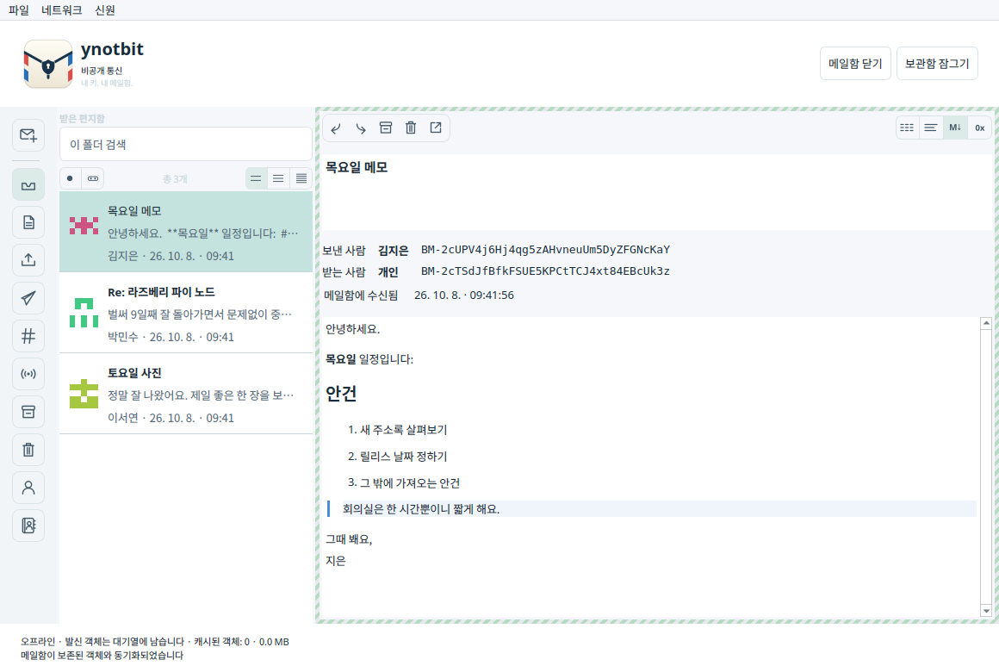
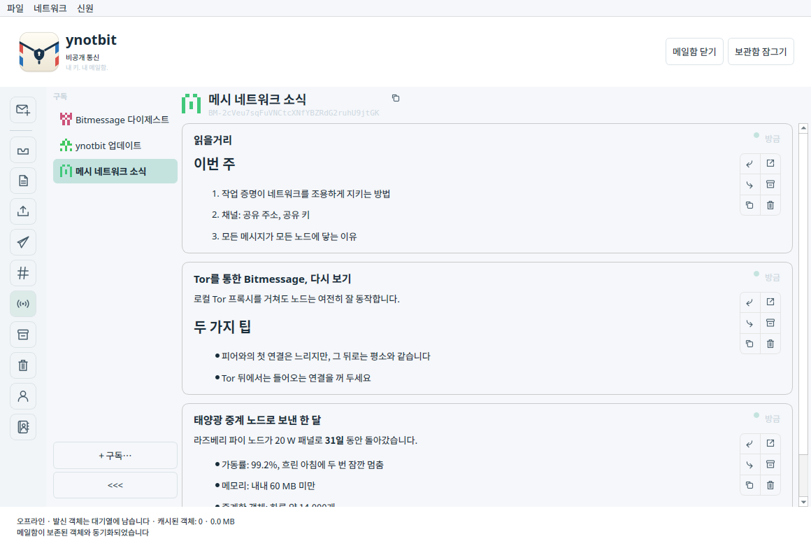
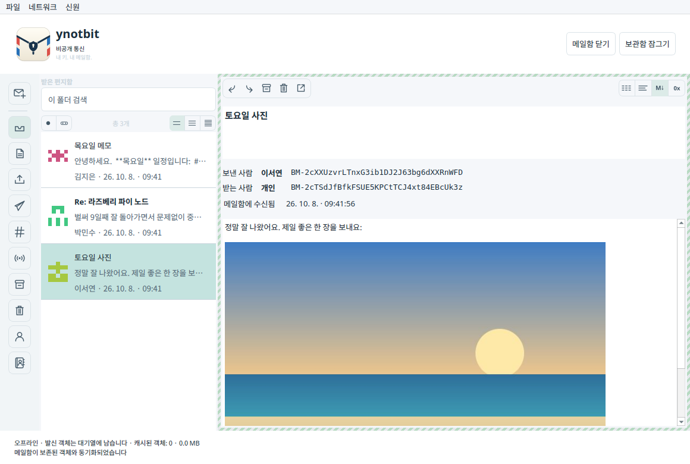
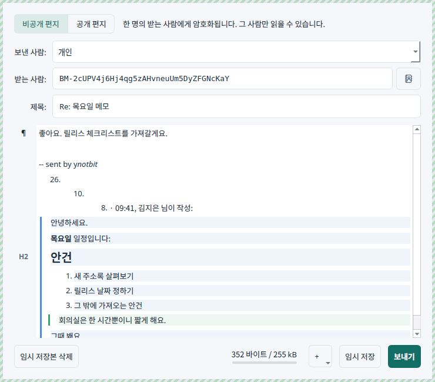
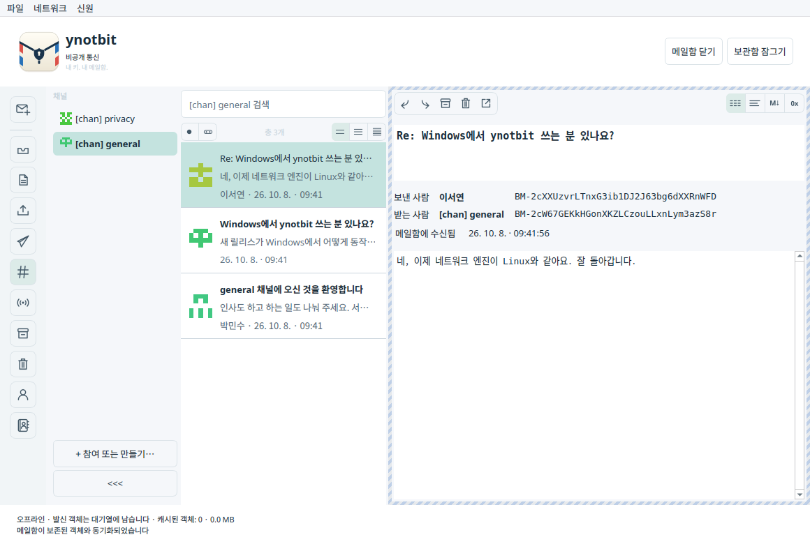
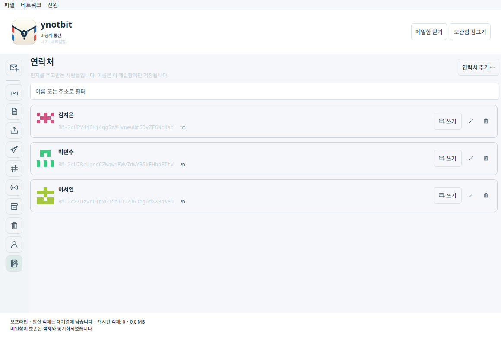
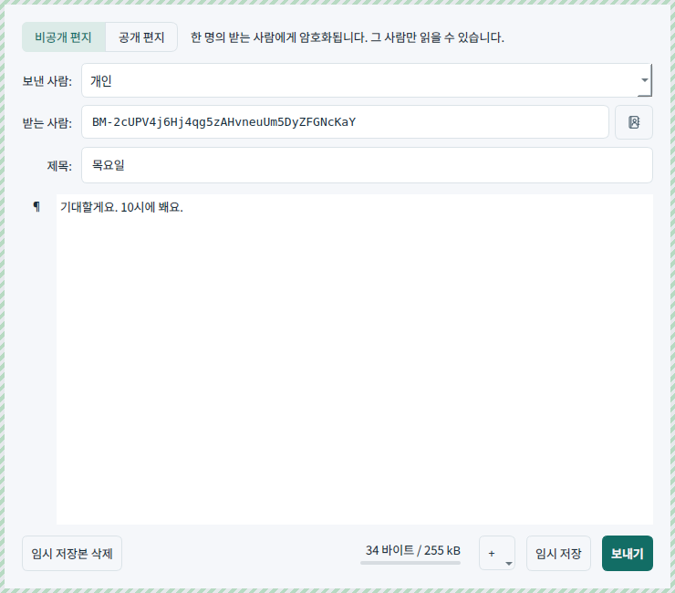

# ynotbit — why not bit?

[English](README.md) | [日本語](README.ja.md) | **한국어**

[notbit](https://github.com/bpeel/notbit)을 기반으로 한 작고 가벼운 데스크톱 Bitmessage
클라이언트입니다. 만든 사람은 [yshurik](https://github.com/yshurik)입니다. **현재 릴리스: 0.6.0**

ynotbit은 신원 키를 비밀번호로 보호되는 보관함에, 주고받은 편지는 별도의 암호화된 메일함
문서에 저장합니다. 키를 갖지 않는 릴레이는 보관함이 잠겨 있는 동안에도 네트워크 객체를 계속
모읍니다. 잠금을 해제하면 보관해 둔 객체를 검사하고, 나에게 온 편지를 메일함에 저장합니다.



| 구독 | 편지 속 그림 | 답장 |
|---|---|---|
|  |  |  |

| 채널 | 연락처 | 연락처에게 편지 쓰기 |
|---|---|---|
|  |  |  |

## 다운로드

[**v0.6.0 릴리스**](https://github.com/yshurik/ynotbit/releases/tag/v0.6.0) — Linux (x86_64),
macOS (Apple Silicon), Windows (x86_64)용으로 미리 빌드하고 CI에서 테스트한 패키지입니다.
각 빌드가 보장하는 것과 보장하지 않는 것은 아래 [현재의 한계](#현재의-한계)를 참고하세요.

시스템 언어가 한국어이면 화면이 한국어로 표시됩니다. **설정 → 모양**에서 직접 고를 수도
있습니다(다시 시작한 뒤 적용).

## 사용 방법

1. `.bmvault` 파일을 만들거나 엽니다. 신원을 만들거나, `keys.dat`를 가져오거나, 공유 문구와
   예상 주소를 입력해 채널에 참여합니다.
2. 문서 폴더처럼 쓰기가 가능한 곳에 `.bmmail` 문서를 만들거나 엽니다.
3. **편지 쓰기**를 고르고, 보낸 사람을 선택한 뒤 받는 사람을 정합니다. 연락처 이름이나
   BM- 주소를 입력하거나, **받는 사람** 옆의 연락처 버튼을 사용하세요. 변경 내용은 암호화된
   메일함에 자동으로 저장됩니다.
4. **보내기**를 고릅니다. 저장된 임시 저장본에는 **편집 / 보내기** 버튼이 있습니다.
5. 진행 상황은 **보낼 편지함**에서 확인합니다. 키 조회와 작업 증명에는 시간이 걸릴 수
   있습니다. 받는 사람의 수신 확인은 비동기로 도착하며, 읽음 확인이 아닙니다.
6. 다 쓰고 나면 보관함을 잠급니다. 준비 작업은 멈추고 메일함은 닫히지만, 릴레이는 이미 넘겨받은
   암호화된 네트워크 객체를 계속 처리합니다.

상대에게 이름을 붙이려면 편지 속 주소 옆에 있는 사람+더하기 버튼을 누르거나
**연락처 → 연락처 추가…**를 사용하세요. 이름은 메시지 목록, 읽기 화면, 편지 작성 화면에
나타나며, 항상 전체 주소와 함께 표시됩니다.

발신자의 브로드캐스트를 팔로우하려면 **구독**을 열고 **+ 구독…**을 고르세요
(또는 **신원 → 브로드캐스트 구독…**). 게시물은 피드로 표시됩니다. 새 메일함은 처음부터
Bitmessage 다이제스트와 ynotbit 업데이트 알림을 구독하고 있습니다.

편지에 그림을 넣으려면 편지 작성 화면의 **+** 버튼이나 오른쪽 클릭 메뉴를 사용하거나, 그림
파일을 편지 위에 끌어다 놓으세요.

**파일 → 메일함 및 보관함 백업…**은 두 문서를 모두 저장합니다. 반드시 둘 다 보관하세요.
메일함만으로는 그 암호화 키를 되살릴 수 없습니다. 비밀번호를 바꿔도 예전 보관함 사본이나
백업이 무효가 되지는 않습니다. 가져오기를 해도 원래의 평문 `keys.dat`는 그대로 남습니다.

## 기능

- 들고 다닐 수 있는 보관함: Argon2id(64 MiB, 3회 반복)와 XChaCha20-Poly1305. 보호된 메모리의
  키 할당, 비밀번호 변경, 신원 이름, 결정적 v3/v4 채널.
- SQLCipher 메일함: 임시 저장본, 본문, 주소, 공개 키, 전달 기록, 수신 확인 토큰, 구독,
  체크포인트가 모두 암호화된 채로 남습니다. 기존 v1 메일함 문서는 임시 저장본을 잃지 않고
  트랜잭션으로 옮겨집니다.
- 받는 사람의 공개 키로 보내기, v2/v3/v4 공개 키 요청과 응답, 취소할 수 있는 백그라운드
  작업 증명(CPU 코어 하나를 뺀 모든 코어와 GPU에서 계산. GPU는 macOS에서는 Metal, 그 밖에서는
  OpenCL), 지속되는 보낼 편지함과 전달 기록.
- 개인 메시지 복호화와 발신자 검증, 수신 확인, 횟수가 제한된 만료 시 자동 재전송, 수동
  재전송과 취소, 인증된 발신자 키를 사용한 답장. 취소해도 이미 릴레이된 객체는 되돌릴 수
  없습니다.
- 주소록: 연락처에는 이 메일함에서만 쓰는 비공개 이름을 붙일 수 있고, 이 이름은 암호화된
  메일함에 저장되며 절대 전송되지 않습니다. 어떤 편지에서든 한 번의 클릭으로 추가할 수 있고,
  목록·읽기 화면·편지 작성 화면(이름 자동 완성과 연락처 선택기)에 이름이 표시됩니다. 전체
  주소는 항상 이름 옆에 보입니다.
- 채널에는 이름이 붙은 선택기가 있고(참여한 채널은 PyBitmessage처럼 `[chan] <문구>`라는
  이름이 됩니다), 메시지 목록과 검색이 채널마다 따로 있으며, **채널에 쓰기** 동작이 있습니다.
  채널 목록은 읽지 않음 표시가 붙은 아이덴티콘 열로 접을 수 있습니다. BM- 주소는 고정폭
  글꼴로 표시되고, 주소마다 GitHub 스타일의 아이덴티콘이 붙습니다.
- 읽기 화면은 편지를 종류(개인, 채널 안의 개인, 익명 채널 게시물, 브로드캐스트)별로 다른 틀로
  구분하고, 일반 텍스트, 텍스트, Markdown, 16진수 보기를 제공합니다. Markdown과 읽을 수 없는
  바이너리는 자동으로 알아냅니다.
- 메시지 세부 정보는 보낸 사람과 받는 사람 주소를 나란히 맞추고, 수신 확인이 도착하면 색으로
  표시하며, 기록된 전달 과정(준비됨, 키 확보됨, 피어에 보냄, 수신 확인됨, 메일함에서 받음)을
  보여 줍니다.
- 브로드캐스트 게시(v4/v5 객체)와 **구독**: 팔로우하는 발신자를 채널 목록과 비슷한 열에
  나열하고, 발신자마다 게시물을 카드 피드로 보여 줍니다. 카드에서 개인적으로 답장, 전달,
  텍스트 복사, 창에서 열기, 보관, 휴지통으로 옮기기를 할 수 있습니다. 새 메일함은 Bitmessage
  다이제스트를 구독하고 있습니다. 공유 채널, 백그라운드에서 실행되는 폴더 검색, 읽음 상태,
  보관, 휴지통과 복원, 명시적인 영구 삭제.
- 업데이트 알림: ynotbit 릴리스 주소(`BM-2666hf5eAbjCJMaPwC7eG3Um55QJGM`)에서 오는 서명된
  브로드캐스트로, 구독하지 않아도 새 버전이 나오면 배너로 알려 줍니다. **설정 → 알림**에서 끌
  수 있습니다.
- 별도 프로세스인 notbit 릴레이는 Linux, macOS, Windows에서 동작하며, 보관함이나 메일함의
  키를 전혀 받지 않습니다. 피어에게는 `/ynotbit:<버전>/`이라고 자신을 알립니다. 크기가 제한된
  로컬 대기열로 네트워크 객체를 받아들이고, 작업 증명을 검증하며, 수락·거부·연결된 피어에
  대한 제공을 기록합니다. 수신 상태는 다시 시작해도 유지됩니다.
- 네트워크 객체는 SQLite 파일 하나, `objects.sqlite`에 저장됩니다. 릴레이가 쓰고 보관 한도에
  맞춰 정리하며, 앱이 읽어 들이므로 새 객체는 다음 새로 고침 때 메일함에 도착합니다.
- 데스크톱 화면은 QML이나 Qt Quick 없이 Qt Widgets로 만들었습니다. 직접 그리는 목록은 메시지
  요약을 100개씩 최대 세 페이지까지만 갖고 있고, 본문은 선택한 편지의 것만 불러옵니다.
- 편지 작성 화면은 시각적인 Markdown 편집기입니다. 문단마다 옆에 있는 표시(¶, H1–H6, 목록,
  코드)를 누르면 MarkText처럼 **변환**이 열립니다. 답장은 원래 편지를 같은 편집기 안에서
  이메일처럼 `>`로 인용합니다. 인용한 글은 고칠 수 있지만 인용으로 남고, 읽기 화면은 인용
  깊이를 색깔 막대로 보여 줍니다. 편지를 전달할 수도 있습니다.
- Bitmessage에는 첨부 파일이 없으므로, 그림은 표준 Markdown `data:` URL로 편지 안에 넣어
  보내며 편지 한 통에 들어가도록 줄입니다. 읽기 화면은 이 그림과 PyBitmessage의 인라인 그림도
  보여 줍니다. PNG, JPEG, GIF, WebP만 불러옵니다. 표시되는 메시지는 로컬 파일이나 원격 그림을
  불러오지 않는 안전한 Markdown 문서를 사용합니다. 모양은 기본적으로 시스템 색 구성을 따르며,
  밝게나 어둡게로 정할 수도 있습니다.
- 화면은 영어, 중국어 간체, 중국어 번체, 일본어, 한국어, 러시아어, 우크라이나어를 지원합니다.
  시스템 언어를 따르거나 **설정 → 모양**에서 고를 수 있습니다(다시 시작한 뒤 적용). 날짜는
  고른 언어의 형식으로 표시됩니다.
- 피어 수, 오프라인 모드, 노드 다시 시작, 그리고 추가 피어, SOCKS5 프록시, 들어오는 연결,
  작업 증명, 테마와 언어를 한곳에서 정하는 **파일 → 설정…** 창. 네트워크 캐시 보관 기간 설정,
  최근 문서 경로, 한 번에 하는 백업.

전달 상태는 **대기 중 → 키 요청 중 → 수신 확인 준비 중 → 작업 증명 → 피어 기다리는 중 →
수신 확인 기다리는 중 → 수신 확인됨**으로 구분됩니다. 브로드캐스트와 채널 메시지는 받는
사람의 수신 확인 없이 **게시됨**으로 끝날 수 있습니다. 피어에 제공했다고 해서 모든 피어나
최종 받는 사람이 받았다는 증거는 아닙니다.

## 빌드와 테스트

필요한 것: CMake 3.22 이상, C++20, Qt 6.8 이상(Core, Gui, Widgets, Network, Test), OpenSSL,
libsodium, SQLCipher, pkg-config, Ninja. 루프백 릴레이 테스트에는 Python 3을 씁니다. 고정된
버전의 저장소 의존 라이브러리를 소스에서 빌드할 때는 Autoconf, Automake, make, Tcl도
필요합니다.

```sh
scripts/build-dependencies.sh /absolute/scratch /absolute/deps
export PKG_CONFIG_PATH=/absolute/deps/lib/pkgconfig
cmake -S . -B build -G Ninja \
  -DCMAKE_PREFIX_PATH=/absolute/Qt/6.8.3/macos \
  -DCMAKE_BUILD_TYPE=Release
cmake --build build --parallel 4
ctest --test-dir build --output-on-failure
```

Linux에서는 Qt 설치의 `gcc_64` 디렉터리를 사용하세요. 실행 파일 타깃은 `ynotbit`이고, macOS에서는
`ynotbit.app`이 만들어집니다. 테스트는 임시 문서와 루프백 피어를 사용하며, 공개 네트워크의
메시지는 쓰지 않습니다. 독립적인 와이어 픽스처는 Python cryptography 50.0.1과
`tests/generate_wire_fixtures.py`로 다시 만들 수 있습니다. 일반 테스트에는 이 패키지가 필요하지
않습니다.

Windows에서는 MSVC와 Ninja로 빌드합니다. OpenSSL, libsodium, SQLCipher는 `build-dependencies.sh`
대신 [vcpkg](https://github.com/microsoft/vcpkg)(`vcpkg.json` 매니페스트, `x64-windows` 트리플렛)로
받고, `-DCMAKE_TOOLCHAIN_FILE=<vcpkg>/scripts/buildsystems/vcpkg.cmake`를 넘깁니다. 세 플랫폼
모두에 대해 CI로 검증된 정확한 절차는 `.github/workflows/release.yml`에 있습니다.

번역은 `translations/ynotbit_<lang>.ts`에 있으며, Qt Linguist나 아무 텍스트 편집기로 고칠 수
있습니다. 코드에서 화면에 보이는 문자열을 바꾼 뒤에는 `cmake --build build --target
update_translations`를 실행해 파일을 새로 고치세요. `scripts/check-translations.py`(테스트이기도
합니다)는 번역되지 않은 항목이나 깨진 `%1` 자리 표시자가 있으면 실패합니다. 저장소 계층과
프로토콜 계층의 오류 메시지는 `scripts/update-error-catalog.py`가 모읍니다.

README 스크린샷은 실제 메일함이 아니라 데모 데이터로 만듭니다.
`cmake --build build --target readme_screenshots`로 빌드한 뒤
`QT_QPA_PLATFORM=offscreen build/readme_screenshots docs/images`로 다시 만들 수 있습니다.
한국어 데모 편지가 들어간 한국어판은 `... docs/images/ko ko`로 만듭니다.

Qt 런타임 라이브러리를 함께 담은 배포용 패키지를 만들려면:

```sh
# macOS
scripts/package-macos.sh /absolute/build /absolute/ynotbit-macos-arm64.zip /absolute/Qt/6.8.3/macos
# Linux — linuxdeploy로 자체 완결형 AppImage 하나를 만듭니다
scripts/package-linux.sh /absolute/build /absolute/ynotbit-x86_64.AppImage /absolute/Qt/6.8.3/gcc_64
```
```powershell
# Windows
scripts/package-windows.ps1 -BuildDir C:\absolute\build -OutputZip C:\absolute\ynotbit-windows-x86_64.zip `
  -QtBinDir C:\absolute\Qt\6.8.3\msvc2022_64\bin -VcpkgBinDir C:\absolute\build\vcpkg_installed\x64-windows\bin
```

## 문서, 네트워크 데이터, 이식성

보관함과 메일함 문서는 원하는 곳에 둘 수 있습니다. 노드와 캐시 폴더는 Qt의 애플리케이션 데이터
위치를 사용합니다. 내부 애플리케이션 식별자는 예전 알파 버전 캐시와의 호환을 위해
`NotbitDesktop/Notbit Desktop` 그대로입니다. `--data-dir /absolute/path`로 노드 폴더를 바꿀 수
있습니다. `--portable`은 실행한 디렉터리를 기준으로 `./notbit-data/node`를 사용합니다.
`--offline`은 네트워크에 연결하지 않고 시작합니다. 릴레이는 앱이 끝날 때 함께 멈춥니다.

네트워크 보관 기간의 기본값은 2 GiB / 90일이며, 노드 폴더의 `objects.sqlite`에서 릴레이가
관리합니다. **설정 → 저장 공간**에서 바꿀 수 있습니다. 로컬 보관은 프로토콜상의 만료보다 길 수
있어서, 나중에 잠금을 해제한 뒤 검사할 수 있습니다. 보관해 둔 객체를 버리면 나중에 되살리지
못할 수도 있지만, 이미 메일함에 저장된 편지에는 영향이 없습니다. 작업 증명은 CPU 코어 하나를
뺀 모든 코어와, GPU가 있으면 GPU에서도 실행됩니다. `YNOTBIT_NO_GPU=1`을 설정하면 CPU만
사용합니다.

## 현재의 한계

아직 개발 중인 소프트웨어입니다. 로컬 테스트는 문서 이전, 잘못된 형식의 객체, 프로토콜 픽스처,
실제 작업 증명, 컨트롤러의 전달, 잠금과 다시 열기, 데스크톱 동작, 실제 루프백 릴레이를 통한
게시를 다룹니다. 이것은 독립적인 보안 감사도, 공개 네트워크 상호 운용성 인증도 아닙니다.
잠그면 보호된 키가 해제되고 접근이 닫히지만, 화면에 표시된 평문의 Qt나 OS 사본이 메모리, 스왑,
크래시 덤프, 스크린샷에서 모두 지워진다는 보장은 없습니다.

macOS용 패키지는 **Apple Silicon, macOS 15.6 이상**을 대상으로 하며, 실행에 필요한 의존
라이브러리를 함께 담고 있습니다. 애드혹 서명만 되어 있고 Developer ID 서명이나 공증은 받지
않았습니다. 0.5.0부터는 Windows 빌드에서도 작은 Winsock 계층
(`third_party/notbit/src/ntb-win32.c`)을 통해 notbit 엔진이 동작합니다. Windows에는 앱이 노드를
깔끔하게 멈추게 할 신호가 없어서 종료할 때 노드가 강제로 끝나며, 저장소가 대기열에 넣었지만
아직 쓰지 않은 작업은 사라집니다. Linux 다운로드는 AppImage 하나입니다. 첨부 파일(편지 안에 넣어
보내는 그림은 제외)과 CPU 병렬 처리 정도 설정은 구현되어 있지 않습니다.

`.github/workflows/release.yml`은 `v*` 태그를 푸시할 때마다(또는 수동으로 실행할 때) Linux,
macOS, Windows를 빌드·테스트·패키징하고, 세 개의 압축 파일을 GitHub Release에 첨부합니다.
`docs/ci/build.yml`은 더 가벼운 지속적 빌드·테스트 워크플로(모든 푸시와 PR, 패키징 없음)의
오래되고 쓰이지 않는 템플릿이며, 아직 `.github/workflows/`에 연결되어 있지 않습니다.

[검증](docs/verification.md), [아키텍처](docs/design.md),
[구현 계획](docs/superpowers/plans/2026-09-13-complete-messaging.md),
[서드파티 저작자 표시](THIRD_PARTY.md)도 참고하세요(모두 영어). ynotbit 고유의 코드는 MIT
라이선스입니다. 함께 포함된 구성 요소는 각자의 라이선스를 따릅니다.
