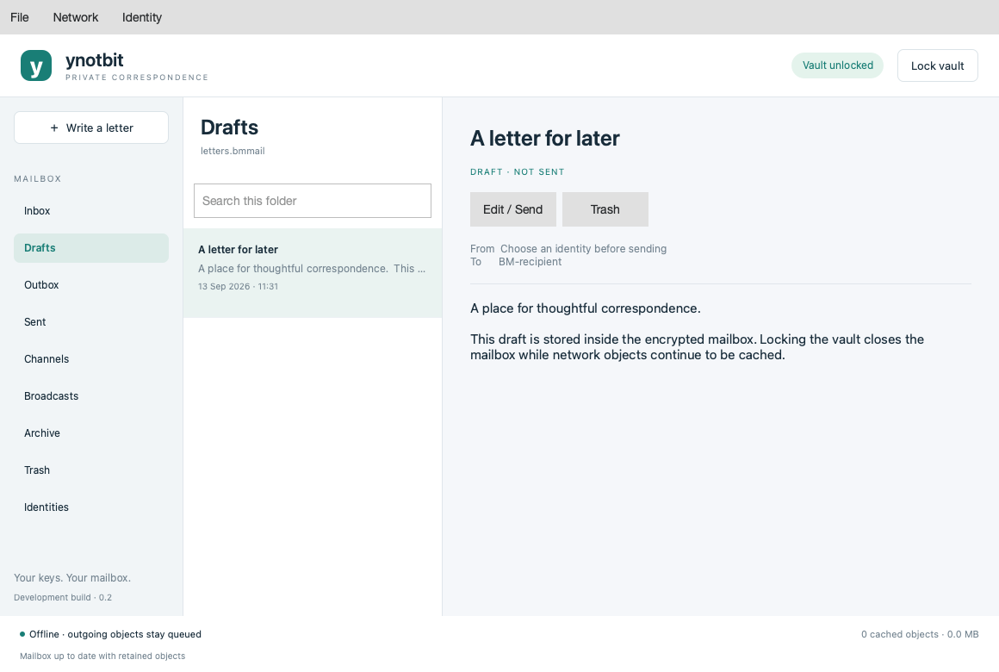

# ynotbit — why not bit?

A compact desktop Bitmessage client based on [notbit](https://github.com/bpeel/notbit),
by [yshurik](https://github.com/yshurik). **Development version: 0.4.7.**

ynotbit keeps identity keys in a password-protected vault and correspondence in a
separate encrypted mailbox document. Its keyless relay continues collecting
network objects while the vault is locked. Unlocking inspects retained objects
and saves matching letters to the mailbox.



## Download

[**v0.4.7 release**](https://github.com/yshurik/ynotbit/releases/tag/v0.4.7) — prebuilt,
CI-tested downloads for Linux (x86_64), macOS (Apple Silicon), and Windows (x86_64).
See [Current boundaries](#current-boundaries) below for what each build does and doesn't
guarantee.

## Using the app

1. Create or open a `.bmvault` file. Create an identity, import `keys.dat`, or join
   a chan using its shared phrase and expected address.
2. Create or open a `.bmmail` document in Documents or another writable folder.
3. Choose **Write a letter**, select the sender, enter a recipient BM-address,
   and write. Changes automatically save in the encrypted mailbox.
4. Choose **Send letter**. Existing drafts have an **Edit / Send** control.
5. Follow progress in **Outbox**. Key lookup and proof of work can take time;
   recipient acknowledgment is asynchronous and is not a read receipt.
6. Lock the vault when finished. Preparation pauses, the mailbox closes, and
   the relay continues handling already submitted encrypted network objects.

**File → Back up mailbox and vault** saves both documents. Keep both: a mailbox
alone cannot recover its encryption key. Changing a password does not invalidate
old vault copies or backups. Import preserves the original plaintext `keys.dat`.

## Available in this development version

- Portable vault: Argon2id (64 MiB, 3 passes) and XChaCha20-Poly1305; guarded key
  allocations; password changes; identity labels; deterministic v3/v4 chans.
- SQLCipher mailbox: drafts, message bodies, addresses, public keys, delivery
  records, acknowledgment tokens, subscriptions, and checkpoints remain encrypted.
  Existing v1 mailbox documents migrate transactionally without losing drafts.
- Sending with public recipient keys; v2/v3/v4 public-key lookup and responses;
  cancellable background proof of work; persistent outbox and delivery history.
- Direct-message decryption and sender verification; acknowledgments; bounded
  automatic expiry retries; manual retry and cancellation; reply using the
  authenticated sender key. Cancellation cannot recall objects already relayed.
- Channels have a named selector, separate message lists and search, and a
  Write to channel action. BM-addresses use a fixed-width font.
- Message details align sender and recipient addresses, color successful
  acknowledgment, and show the recorded delivery timeline: prepared, key
  available, sent to peers, acknowledged, or received in the mailbox.
- Broadcast publishing/subscriptions (v4/v5 objects), shared chans, folder search,
  read state, archive, trash/restore, and explicit permanent deletion.
- A separate notbit relay receives no vault or mailbox keys. Its bounded local
  queue accepts network objects, validates proof of work, and records acceptance,
  rejection, and offers to connected peers. Receipt state survives restarts.
- A Qt-native bounded relay is also available for non-Unix builds (`--qt-node`),
  with the same object limits, persistence, SOCKS5 support, peer admission rules,
  and publication receipts. Unix builds continue to use the mature notbit engine.
- The desktop uses Qt Widgets, without QML or Qt Quick. A painted list keeps at
  most three pages of 100 message summaries, loading only the selected body.
- The composer is a visual Markdown editor. Rendered messages use a safe Markdown
  document that does not fetch local files or remote images. Appearance follows the
  system color scheme by default and can be set to light or dark.
- Peer count, offline mode, node restart, additional peer and SOCKS5 proxy settings,
  configurable network-cache retention, recent document paths, and combined backup.

Delivery distinguishes **queued → requesting key → preparing receipt → proof of
work → waiting for peers → awaiting acknowledgment → acknowledged**. Broadcasts
and chan messages can finish as **published**, without a recipient receipt.
An offer to peers is not proof that every peer or the final recipient received it.

## Build and test

Requirements: CMake 3.22+, C++20, Qt 6.8+ (Core, Gui, Widgets, Network, Test), OpenSSL, libsodium, SQLCipher, pkg-config, Ninja.
Python 3 runs the loopback relay tests. Autoconf, Automake, make and Tcl are
needed when building the pinned storage dependencies from source.

```sh
scripts/build-dependencies.sh /absolute/scratch /absolute/deps
export PKG_CONFIG_PATH=/absolute/deps/lib/pkgconfig
cmake -S . -B build -G Ninja \
  -DCMAKE_PREFIX_PATH=/absolute/Qt/6.8.3/macos \
  -DCMAKE_BUILD_TYPE=Release
cmake --build build --parallel 4
ctest --test-dir build --output-on-failure
```

On Linux, use your Qt installation's `gcc_64` directory. The executable target
is `ynotbit`; macOS produces `ynotbit.app`. Tests use temporary documents and
loopback peers, never public-network messages. The independent wire fixtures can
be regenerated with `tests/generate_wire_fixtures.py` using Python cryptography
50.0.1; the normal test suite does not need that package.

On Windows, build with MSVC and Ninja; get OpenSSL, libsodium, and SQLCipher via
[vcpkg](https://github.com/microsoft/vcpkg) (`vcpkg.json` manifest, `x64-windows`
triplet) instead of `build-dependencies.sh`, and pass
`-DCMAKE_TOOLCHAIN_FILE=<vcpkg>/scripts/buildsystems/vcpkg.cmake`. See
`.github/workflows/release.yml` for the exact, CI-verified sequence on all three
platforms.

To package a build for redistribution, with Qt's runtime libraries bundled in:

```sh
# macOS
scripts/package-macos.sh /absolute/build /absolute/ynotbit-macos-arm64.zip /absolute/Qt/6.8.3/macos
# Linux — builds a self-contained AppDir with linuxdeploy
scripts/package-linux.sh /absolute/build /absolute/ynotbit-linux-x86_64.tar.gz /absolute/Qt/6.8.3/gcc_64
```
```powershell
# Windows
scripts/package-windows.ps1 -BuildDir C:\absolute\build -OutputZip C:\absolute\ynotbit-windows-x86_64.zip `
  -QtBinDir C:\absolute\Qt\6.8.3\msvc2022_64\bin -VcpkgBinDir C:\absolute\build\vcpkg_installed\x64-windows\bin
```

## Documents, network data, and portability

Vault and mailbox documents live wherever you choose. The node/cache directory
uses Qt's application-data location. Its internal application identifier remains
`NotbitDesktop/Notbit Desktop` for compatibility with the earlier alpha's cache.
`--data-dir /absolute/path` overrides the node folder. `--portable` uses
`./notbit-data/node` relative to the launch directory. `--offline` starts without
network connections. The relay stops when the application exits.

Default network retention is 512 MiB / 90 days; change it under **Network**.
Local retention can outlive protocol expiry, allowing later unlocked inspection.
Discarding a retained object can prevent later recovery; already saved mailbox
letters are unaffected. Proof of work uses one background CPU thread.

## Current boundaries

This remains development software. Local tests cover document migration,
malformed objects, protocol fixtures, real proof of work, controller delivery,
lock/reopen, desktop actions, and real loopback relay publication. This is not
an independent security audit or a public-network interoperability certification.
Lock releases guarded keys and closes access; Qt/OS copies of displayed plaintext
are not guaranteed erased from all memory, swap, crash dumps or screenshots.

The packaged macOS build targets **Apple Silicon, macOS 15.6+** and bundles its
runtime dependencies. It is ad-hoc signed, not Developer ID signed or notarized.
The Windows build uses the Qt-native relay path (`--qt-node`) rather than the
notbit engine, which is Unix-only; both use the same wire protocol and storage.
Attachment UI and configurable CPU parallelism are not implemented.

`.github/workflows/release.yml` builds, tests, and packages Linux, macOS, and
Windows on every `v*` tag push (or manual dispatch), then attaches the three
archives to a GitHub Release. `docs/ci/build.yml` is an older, unused template
for a lighter continuous build-and-test workflow (every push/PR, no packaging);
it's not wired into `.github/workflows/` yet.

See [verification](docs/verification.md), [architecture](docs/design.md),
[implementation plan](docs/superpowers/plans/2026-09-13-complete-messaging.md),
and [third-party attribution](THIRD_PARTY.md). Original ynotbit code is MIT
licensed; vendored components retain their own licenses.
