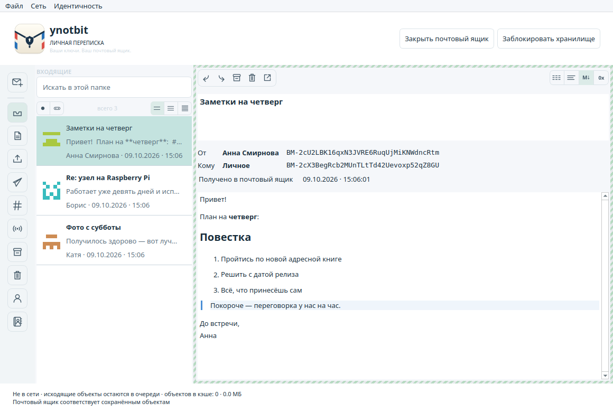
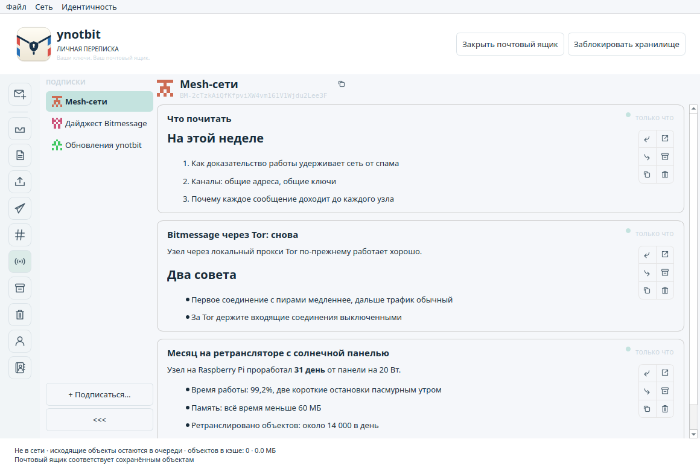
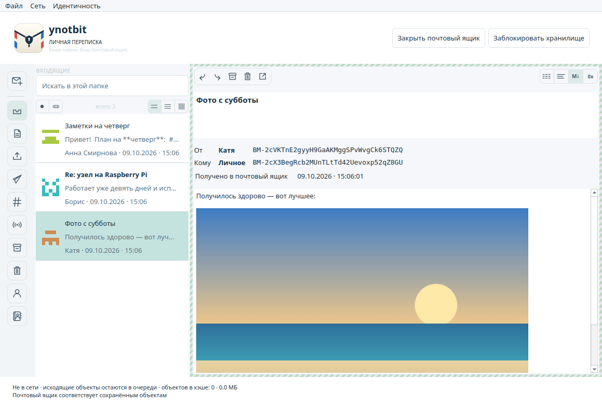
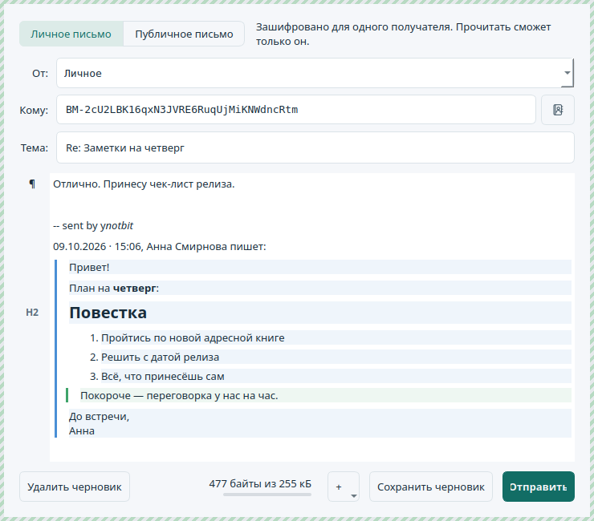
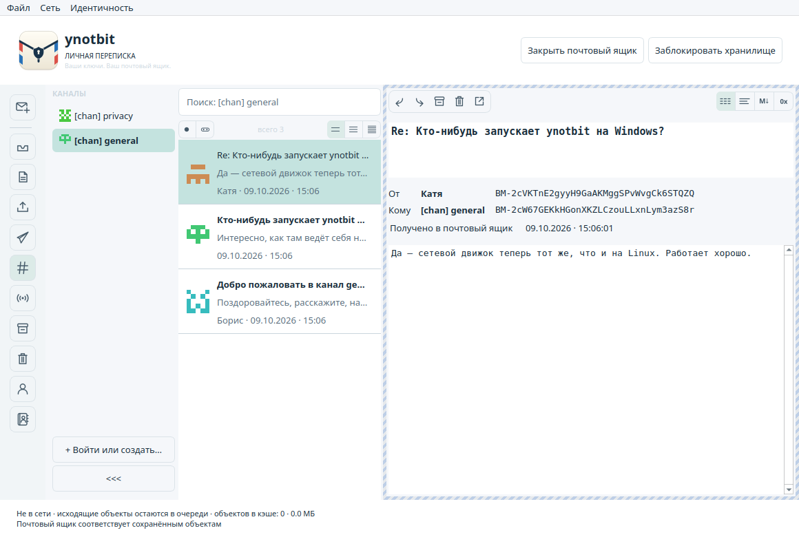
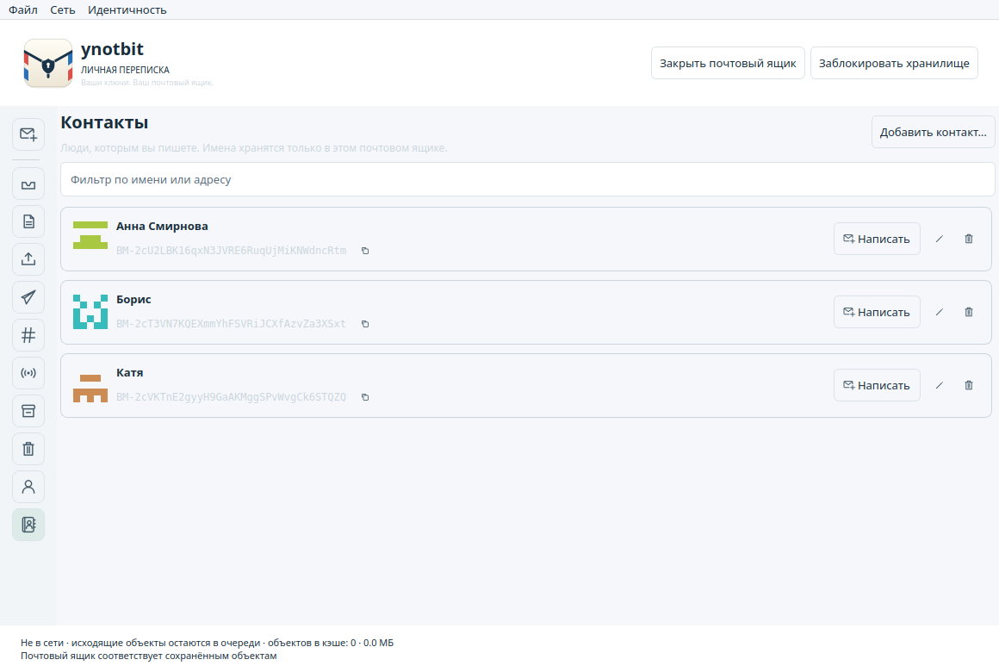
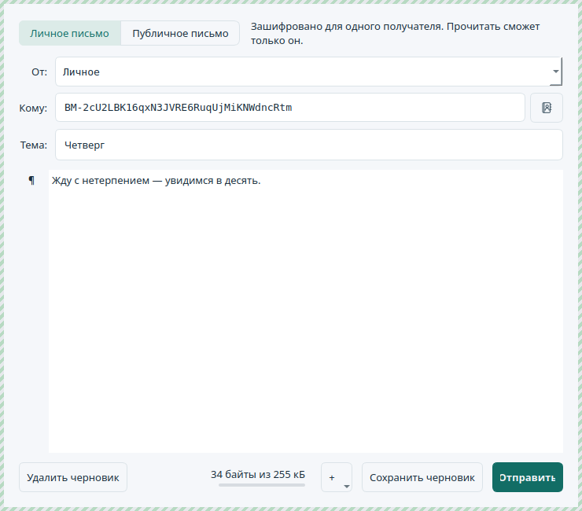

# ynotbit — why not bit?

[English](README.md) | [日本語](README.ja.md) | [한국어](README.ko.md) | [简体中文](README.zh-CN.md) | [繁體中文](README.zh-TW.md) | **Русский** | [Українська](README.uk.md)

Компактный настольный клиент Bitmessage на основе [notbit](https://github.com/bpeel/notbit).
Автор — [yshurik](https://github.com/yshurik). **Текущая версия: 0.6.0.**

ynotbit хранит ключи идентичностей в защищённом паролем хранилище, а переписку — в отдельном
зашифрованном документе почтового ящика. Его ретранслятор без ключей продолжает собирать сетевые
объекты, пока хранилище заблокировано. После разблокировки он проверяет накопленные объекты и
сохраняет письма, адресованные вам, в почтовый ящик.



| Подписки | Картинки в письме | Ответ |
|---|---|---|
|  |  |  |

| Каналы | Контакты | Письмо контакту |
|---|---|---|
|  |  |  |

## Скачать

[**Релиз v0.6.0**](https://github.com/yshurik/ynotbit/releases/tag/v0.6.0) — готовые сборки,
проверенные в CI, для Linux (x86_64), macOS (Apple Silicon) и Windows (x86_64).
Что каждая сборка гарантирует, а что нет, — в разделе [Текущие ограничения](#текущие-ограничения) ниже.

Если язык системы русский, интерфейс будет на русском. Язык можно выбрать и вручную в
**Настройки → Оформление** (применяется после перезапуска).

## Как пользоваться

1. Создайте или откройте файл `.bmvault`. Создайте идентичность, импортируйте `keys.dat` или
   вступите в канал по его общей фразе и ожидаемому адресу.
2. Создайте или откройте документ `.bmmail` в «Документах» или другой папке, доступной для записи.
3. Выберите **Написать письмо**, укажите отправителя и получателя: введите имя контакта или
   BM-адрес либо нажмите кнопку контактов рядом с полем **Кому**. Изменения сами сохраняются в
   зашифрованном почтовом ящике.
4. Нажмите **Отправить**. У сохранённых черновиков есть кнопка **Изменить / отправить**.
5. Следите за ходом отправки в **Исходящих**. Поиск ключа и доказательство работы могут занять
   время; подтверждение от получателя приходит асинхронно и не означает, что письмо прочитано.
6. Закончив, заблокируйте хранилище. Подготовка писем приостановится, почтовый ящик закроется,
   а ретранслятор продолжит обрабатывать уже переданные ему зашифрованные сетевые объекты.

Чтобы дать человеку имя, нажмите кнопку с человечком и плюсом рядом с его адресом в письме
или выберите **Контакты → Добавить контакт…**. Имя появится в списке писем, в окне чтения и
в окне письма — всегда рядом с полным адресом.

Чтобы следить за рассылками отправителя, откройте **Подписки** и выберите **+ Подписаться…**
(или **Идентичность → Подписаться на рассылки…**): его посты появятся в виде ленты. Новые
почтовые ящики уже подписаны на дайджест Bitmessage и на уведомления об обновлениях ynotbit.

Чтобы добавить в письмо картинку, нажмите кнопку **+** в окне письма, воспользуйтесь
контекстным меню или перетащите файлы изображений на письмо.

**Файл → Резервная копия почтового ящика и хранилища…** сохраняет оба документа. Храните оба:
по одному почтовому ящику его ключ шифрования не восстановить. Смена пароля не делает
недействительными старые копии хранилища и резервные копии. Импорт оставляет исходный
`keys.dat` в открытом виде нетронутым.

## Возможности

- Переносимое хранилище: Argon2id (64 МиБ, 3 прохода) и XChaCha20-Poly1305; ключи в защищённой
  памяти; смена пароля; имена идентичностей; детерминированные каналы v3/v4.
- Почтовый ящик на SQLCipher: черновики, тексты писем, адреса, открытые ключи, записи о доставке,
  токены подтверждений, подписки и контрольные точки остаются зашифрованными. Документы ящиков
  версии v1 переносятся в одной транзакции без потери черновиков.
- Отправка на открытые ключи получателей; запросы открытых ключей v2/v3/v4 и ответы на них;
  отменяемое фоновое доказательство работы на всех ядрах процессора, кроме одного, и на GPU
  (Metal на macOS, OpenCL на других системах); исходящие и история доставки сохраняются.
- Расшифровка личных сообщений и проверка отправителя; подтверждения; ограниченное число
  автоматических повторов по истечении срока; ручной повтор и отмена; ответ на проверенный ключ
  отправителя. Отмена не может отозвать объекты, которые уже ретранслированы.
- Адресная книга: у контактов локальные приватные имена, они хранятся в зашифрованном ящике и
  никуда не отправляются. Добавление в один клик из любого письма; имена в списке, окне чтения
  и окне письма (дополнение по имени и выбор из контактов); полный адрес всегда виден рядом
  с именем.
- У каналов есть список с именами (каналы, в которые вы вступили, называются `[chan] <фраза>`,
  как в PyBitmessage), отдельные списки сообщений и поиск, а также действие **Написать в канал**.
  Список каналов сворачивается в столбец идентиконов с метками непрочитанного. BM-адреса
  набраны моноширинным шрифтом, у каждого адреса свой идентикон в стиле GitHub.
- Окно чтения обрамляет письмо по типу (личное, личное в канале, анонимный пост в канале,
  рассылка) и показывает его как простой текст, текст, Markdown или hex, сам распознавая
  Markdown и нечитаемые двоичные данные.
- Подробности сообщения выравнивают адреса отправителя и получателя, выделяют цветом успешное
  подтверждение и показывают записанную историю доставки: подготовлено, ключ получен, отправлено
  пирам, подтверждено или получено в почтовый ящик.
- Публикация рассылок (объекты v4/v5) и **Подписки**: отслеживаемые отправители в колонке, как
  список каналов, и посты каждого отправителя лентой карточек с действиями «Ответить лично»,
  «Переслать», «Копировать текст», «Открыть в окне», «Архив» и «Корзина». Новые ящики подписаны
  на дайджест Bitmessage. Общие каналы, поиск по папке в фоне, отметки о прочтении, архив,
  корзина с восстановлением и явное окончательное удаление.
- Уведомления об обновлениях: подписанные рассылки с адреса релизов ynotbit
  (`BM-2666hf5eAbjCJMaPwC7eG3Um55QJGM`) показывают баннер, когда выходит новая версия, без
  подписки; отключаются в **Настройки → Уведомления**.
- Отдельный ретранслятор notbit работает на Linux, macOS и Windows и не получает ключей ни от
  хранилища, ни от почтового ящика. Пирам он представляется как `/ynotbit:<версия>/`. Его
  ограниченная локальная очередь принимает сетевые объекты, проверяет доказательство работы и
  записывает приём, отклонение и раздачу подключённым пирам. Состояние приёма переживает перезапуск.
- Сетевые объекты хранятся в одном файле SQLite, `objects.sqlite`: ретранслятор пишет в него и
  чистит по лимитам хранения, приложение читает, поэтому новые объекты попадают в почтовый ящик
  при следующем обновлении.
- Интерфейс написан на Qt Widgets, без QML и Qt Quick. Отрисованный список держит не больше трёх
  страниц по 100 заголовков писем и загружает текст только выбранного письма.
- Окно письма — визуальный редактор Markdown. Значок у каждого абзаца (¶, H1–H6, список, код)
  открывает **Превратить в**, как в MarkText. Ответы цитируют письмо в стиле электронной почты,
  через `>`, в том же редакторе: цитату можно править, но она остаётся цитатой, а окно чтения
  показывает уровни цитирования цветными полосами. Письма можно пересылать.
- В Bitmessage нет вложений, поэтому картинки едут внутри письма как стандартные Markdown-ссылки
  `data:` и уменьшаются так, чтобы поместиться в одно письмо. Окно чтения показывает их, а также
  встроенные картинки PyBitmessage; загружаются только PNG, JPEG, GIF и WebP. Сообщения
  отображаются через безопасный документ Markdown, который не загружает локальные файлы и
  удалённые изображения. Оформление по умолчанию следует цветовой схеме системы, можно выбрать
  светлое или тёмное.
- Интерфейс на английском, упрощённом и традиционном китайском, японском, корейском, русском и
  украинском. Язык берётся из системы или выбирается в **Настройки → Оформление** (применяется
  после перезапуска). Даты выводятся в формате выбранного языка.
- Число пиров, автономный режим, перезапуск узла и одно окно **Файл → Настройки…** для
  дополнительного пира, прокси SOCKS5, входящих соединений, доказательства работы, темы и языка;
  настраиваемый срок хранения сетевого кэша, недавние документы и общая резервная копия.

Доставка различает состояния **в очереди → запрос ключа → подготовка квитанции → доказательство
работы → ожидание пиров → ожидание подтверждения → подтверждено**. Рассылки и сообщения в каналах
могут завершиться состоянием **опубликовано**, без квитанции от получателя. То, что объект
предложен пирам, не доказывает, что его получили все пиры или конечный получатель.

## Сборка и тесты

Нужно: CMake 3.22+, C++20, Qt 6.8+ (Core, Gui, Widgets, Network, Test), OpenSSL, libsodium,
SQLCipher, pkg-config, Ninja. Python 3 нужен для тестов ретранслятора через loopback. Autoconf,
Automake, make и Tcl нужны, если собирать закреплённые версии библиотек хранения из исходников.

```sh
scripts/build-dependencies.sh /absolute/scratch /absolute/deps
export PKG_CONFIG_PATH=/absolute/deps/lib/pkgconfig
cmake -S . -B build -G Ninja \
  -DCMAKE_PREFIX_PATH=/absolute/Qt/6.8.3/macos \
  -DCMAKE_BUILD_TYPE=Release
cmake --build build --parallel 4
ctest --test-dir build --output-on-failure
```

На Linux укажите каталог `gcc_64` вашей установки Qt. Цель сборки исполняемого файла — `ynotbit`;
на macOS получается `ynotbit.app`. Тесты используют временные документы и пиры на loopback и
никогда не трогают сообщения из публичной сети. Независимые эталонные данные протокола можно
пересоздать скриптом `tests/generate_wire_fixtures.py` с Python cryptography 50.0.1; обычным
тестам этот пакет не нужен.

На Windows сборка идёт через MSVC и Ninja; OpenSSL, libsodium и SQLCipher берутся из
[vcpkg](https://github.com/microsoft/vcpkg) (манифест `vcpkg.json`, триплет `x64-windows`) вместо
`build-dependencies.sh`, и нужно передать
`-DCMAKE_TOOLCHAIN_FILE=<vcpkg>/scripts/buildsystems/vcpkg.cmake`. Точная последовательность шагов
для всех трёх платформ, проверенная в CI, — в `.github/workflows/release.yml`.

Переводы лежат в `translations/ynotbit_<lang>.ts`, их можно править в Qt Linguist или любом
текстовом редакторе. После изменения видимых пользователю строк в коде запустите
`cmake --build build --target update_translations`, чтобы обновить файлы;
`scripts/check-translations.py` (он же тест) падает на непереведённых строках и сломанных
подстановках `%1`. Сообщения об ошибках слоёв хранения и протокола собирает
`scripts/update-error-catalog.py`.

Скриншоты для README делаются на демо-данных, а не на настоящем почтовом ящике. Соберите
`cmake --build build --target readme_screenshots` и запустите
`QT_QPA_PLATFORM=offscreen build/readme_screenshots docs/images`; русские, с русскими
демо-письмами, — `... docs/images/ru ru`.

Чтобы собрать пакет для распространения, с библиотеками Qt внутри:

```sh
# macOS
scripts/package-macos.sh /absolute/build /absolute/ynotbit-macos-arm64.zip /absolute/Qt/6.8.3/macos
# Linux — один самодостаточный AppImage через linuxdeploy
scripts/package-linux.sh /absolute/build /absolute/ynotbit-x86_64.AppImage /absolute/Qt/6.8.3/gcc_64
```
```powershell
# Windows
scripts/package-windows.ps1 -BuildDir C:\absolute\build -OutputZip C:\absolute\ynotbit-windows-x86_64.zip `
  -QtBinDir C:\absolute\Qt\6.8.3\msvc2022_64\bin -VcpkgBinDir C:\absolute\build\vcpkg_installed\x64-windows\bin
```

## Документы, сетевые данные и переносимость

Документы хранилища и почтового ящика могут лежать где угодно. Папка узла и кэша находится в
стандартном для Qt месте данных приложения. Внутренний идентификатор приложения остался
`NotbitDesktop/Notbit Desktop` ради совместимости с кэшем ранней альфа-версии.
`--data-dir /absolute/path` задаёт другую папку узла. `--portable` использует
`./notbit-data/node` относительно каталога запуска. `--offline` запускает приложение без
сетевых соединений. Ретранслятор останавливается вместе с приложением.

По умолчанию сетевые данные хранятся в пределах 2 ГиБ / 90 дней; за этим следит ретранслятор в
`objects.sqlite` в папке узла, а изменить лимиты можно в **Настройки → Хранение**. Локальное хранение может длиться дольше
срока жизни объектов по протоколу, чтобы их можно было проверить после разблокировки. Если
удалить накопленный объект, восстановить его потом может не получиться; письма, уже сохранённые
в почтовом ящике, это не затрагивает. Доказательство работы считается на всех ядрах процессора,
кроме одного, и на GPU, если он есть; с `YNOTBIT_NO_GPU=1` считает только процессор.

## Текущие ограничения

Это всё ещё программа в разработке. Локальные тесты покрывают перенос документов, повреждённые
объекты, эталонные данные протокола, настоящее доказательство работы, доставку через
контроллер, блокировку и повторное открытие, действия в интерфейсе и настоящую публикацию через
ретранслятор на loopback. Это не независимый аудит безопасности и не сертификация совместимости
с публичной сетью. Блокировка освобождает защищённые ключи и закрывает доступ, но не гарантирует,
что копии показанного открытого текста, сделанные Qt или ОС, исчезнут из памяти, файла подкачки,
аварийных дампов и скриншотов.

Пакет для macOS рассчитан на **Apple Silicon, macOS 15.6+** и содержит все зависимости. Он
подписан только ad-hoc, без подписи Developer ID и без нотаризации. С версии 0.5.0 и сборка для
Windows запускает движок notbit — через небольшую прослойку Winsock
(`third_party/notbit/src/ntb-win32.c`). В Windows нет сигнала, которым приложение могло бы
аккуратно остановить узел, поэтому при выходе узел завершается принудительно, и работа,
поставленная хранилищем в очередь, но ещё не записанная, теряется. Для Linux — один AppImage.
Вложения (кроме картинок внутри письма) и настройка числа потоков процессора не реализованы.

`.github/workflows/release.yml` собирает, тестирует и упаковывает Linux, macOS и Windows при
каждом пуше тега `v*` (или ручном запуске) и прикладывает три архива к GitHub Release.
`docs/ci/build.yml` — старый неиспользуемый шаблон более лёгкой непрерывной сборки и тестов (на
каждый пуш и PR, без упаковки); в `.github/workflows/` он пока не подключён.

См. также [проверку](docs/verification.md), [архитектуру](docs/design.md),
[план реализации](docs/superpowers/plans/2026-09-13-complete-messaging.md) и
[сторонние компоненты](THIRD_PARTY.md) (всё на английском). Собственный код ynotbit
распространяется по лицензии MIT; включённые компоненты сохраняют свои лицензии.
