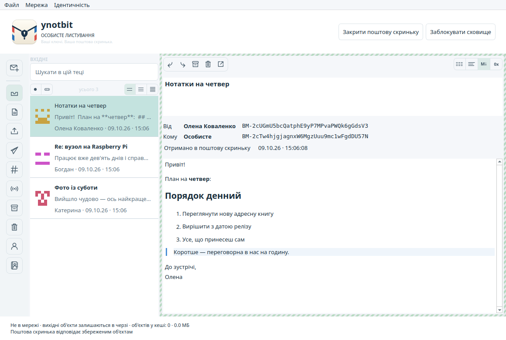
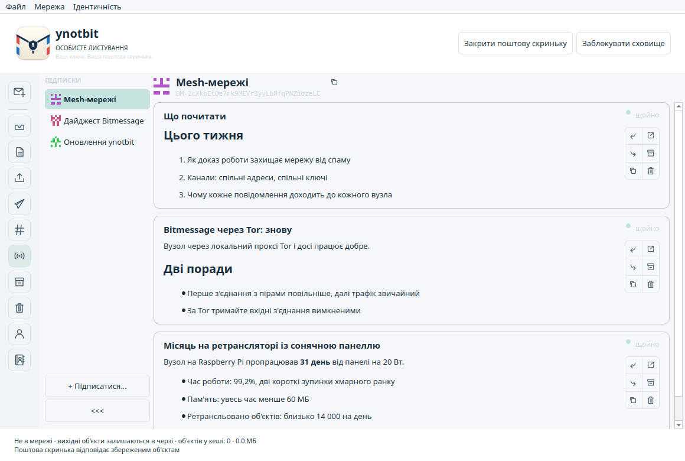
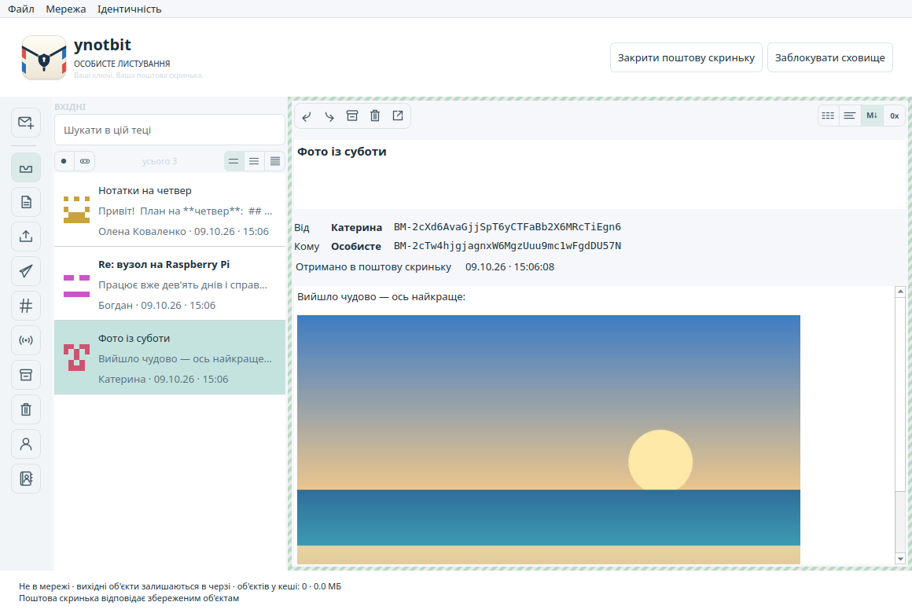
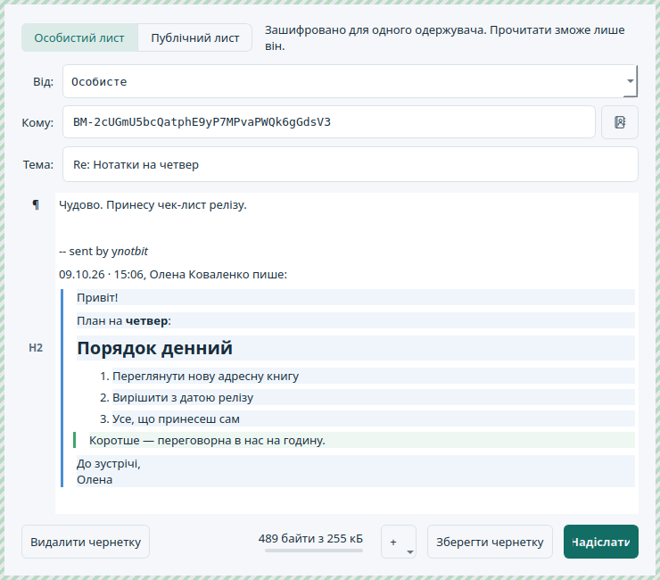
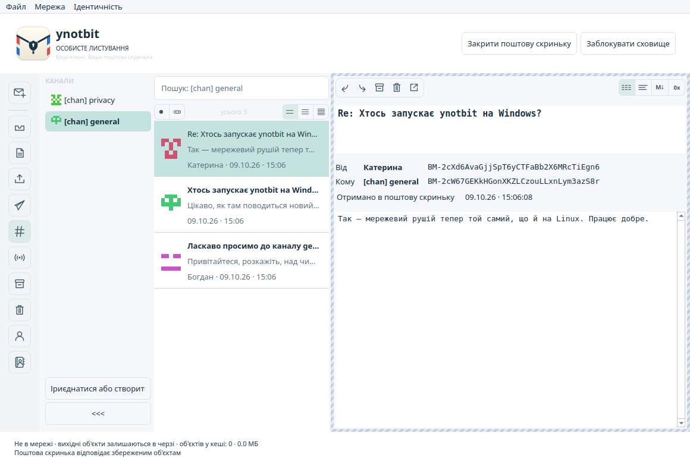
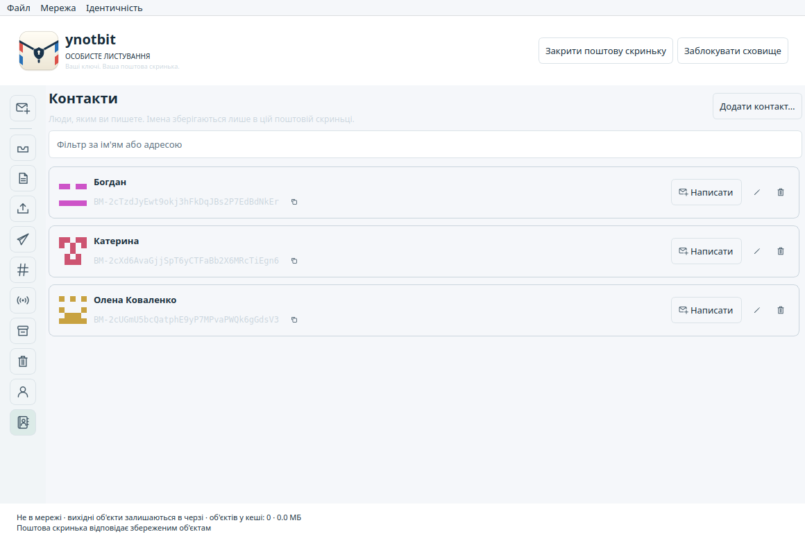
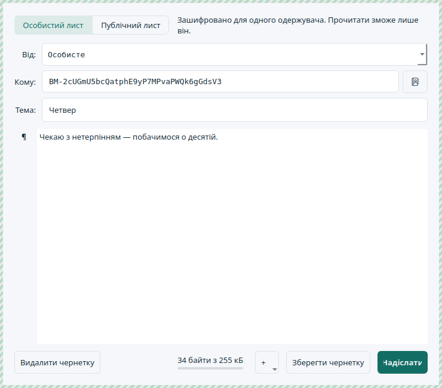

# ynotbit — why not bit?

[English](README.md) | [日本語](README.ja.md) | [한국어](README.ko.md) | [简体中文](README.zh-CN.md) | [繁體中文](README.zh-TW.md) | [Русский](README.ru.md) | **Українська**

Компактний настільний клієнт Bitmessage на основі [notbit](https://github.com/bpeel/notbit).
Автор — [yshurik](https://github.com/yshurik). **Поточна версія: 0.6.0.**

ynotbit зберігає ключі ідентичностей у захищеному паролем сховищі, а листування — в окремому
зашифрованому документі поштової скриньки. Його ретранслятор без ключів і далі збирає мережеві
об'єкти, поки сховище заблоковане. Після розблокування він перевіряє накопичені об'єкти й
зберігає листи, адресовані вам, у поштову скриньку.



| Підписки | Картинки в листі | Відповідь |
|---|---|---|
|  |  |  |

| Канали | Контакти | Лист контакту |
|---|---|---|
|  |  |  |

## Завантажити

[**Реліз v0.6.0**](https://github.com/yshurik/ynotbit/releases/tag/v0.6.0) — готові збірки,
перевірені в CI, для Linux (x86_64), macOS (Apple Silicon) і Windows (x86_64).
Що кожна збірка гарантує, а що ні, — у розділі [Поточні обмеження](#поточні-обмеження) нижче.

Якщо мова системи українська, інтерфейс буде українською. Мову можна вибрати й вручну в
**Налаштування → Вигляд** (застосовується після перезапуску).

## Як користуватися

1. Створіть або відкрийте файл `.bmvault`. Створіть ідентичність, імпортуйте `keys.dat` або
   приєднайтеся до каналу за його спільною фразою та очікуваною адресою.
2. Створіть або відкрийте документ `.bmmail` у «Документах» чи іншій теці, доступній для запису.
3. Виберіть **Написати листа**, вкажіть відправника й одержувача: введіть ім'я контакту або
   BM-адресу чи натисніть кнопку контактів поруч із полем **Кому**. Зміни самі зберігаються в
   зашифрованій поштовій скриньці.
4. Натисніть **Надіслати**. У збережених чернеток є кнопка **Змінити / надіслати**.
5. Стежте за надсиланням у **Вихідних**. Пошук ключа й доказ роботи можуть тривати якийсь час;
   підтвердження від одержувача приходить асинхронно й не означає, що лист прочитано.
6. Закінчивши, заблокуйте сховище. Підготовка листів призупиниться, поштова скринька закриється,
   а ретранслятор і далі оброблятиме вже передані йому зашифровані мережеві об'єкти.

Щоб дати людині ім'я, натисніть кнопку з чоловічком і плюсом поруч із її адресою в листі
або виберіть **Контакти → Додати контакт…**. Ім'я з'явиться в списку листів, у вікні читання
та у вікні листа — завжди поруч із повною адресою.

Щоб стежити за розсилками відправника, відкрийте **Підписки** й виберіть **+ Підписатися…**
(або **Ідентичність → Підписатися на розсилки…**): його дописи з'являться стрічкою. Нові
поштові скриньки вже підписані на дайджест Bitmessage і на сповіщення про оновлення ynotbit.

Щоб додати в лист картинку, натисніть кнопку **+** у вікні листа, скористайтеся контекстним
меню або перетягніть файли зображень на лист.

**Файл → Резервна копія поштової скриньки та сховища…** зберігає обидва документи. Зберігайте
обидва: з однієї поштової скриньки її ключ шифрування не відновити. Зміна пароля не робить
недійсними старі копії сховища й резервні копії. Імпорт залишає вихідний відкритий `keys.dat`
без змін.

## Можливості

- Переносне сховище: Argon2id (64 МіБ, 3 проходи) і XChaCha20-Poly1305; ключі в захищеній
  пам'яті; зміна пароля; імена ідентичностей; детерміновані канали v3/v4.
- Поштова скринька на SQLCipher: чернетки, тексти листів, адреси, відкриті ключі, записи про
  доставку, токени підтверджень, підписки й контрольні точки залишаються зашифрованими. Документи
  скриньок версії v1 переносяться в одній транзакції без втрати чернеток.
- Надсилання на відкриті ключі одержувачів; запити відкритих ключів v2/v3/v4 і відповіді на них;
  фоновий доказ роботи, який можна скасувати, на всіх ядрах процесора, крім одного, і на GPU
  (Metal на macOS, OpenCL на інших системах); вихідні та історія доставки зберігаються.
- Розшифрування особистих повідомлень і перевірка відправника; підтвердження; обмежена кількість
  автоматичних повторів після закінчення терміну; ручний повтор і скасування; відповідь на
  перевірений ключ відправника. Скасування не може відкликати об'єкти, які вже ретрансльовано.
- Адресна книга: у контактів локальні приватні імена, вони зберігаються в зашифрованій скриньці
  й нікуди не надсилаються. Додавання одним кліком із будь-якого листа; імена в списку, вікні
  читання та вікні листа (доповнення за іменем і вибір із контактів); повна адреса завжди
  видна поруч з іменем.
- Канали мають список з іменами (канали, до яких ви приєдналися, називаються `[chan] <фраза>`,
  як у PyBitmessage), окремі списки повідомлень і пошук, а також дію **Написати в канал**.
  Список каналів згортається в стовпчик ідентиконів із позначками непрочитаного. BM-адреси
  набрано моноширинним шрифтом, кожна адреса має свій ідентикон у стилі GitHub.
- Вікно читання обрамлює лист за типом (особистий, особистий у каналі, анонімний допис у каналі,
  розсилка) і показує його як простий текст, текст, Markdown або hex, сам розпізнаючи Markdown
  і нечитабельні двійкові дані.
- Подробиці повідомлення вирівнюють адреси відправника й одержувача, виділяють кольором успішне
  підтвердження й показують записану історію доставки: підготовлено, ключ отримано, надіслано
  пірам, підтверджено або отримано в поштову скриньку.
- Публікація розсилок (об'єкти v4/v5) і **Підписки**: відстежувані відправники в колонці, як
  список каналів, і дописи кожного відправника стрічкою карток із діями «Відповісти особисто»,
  «Переслати», «Копіювати текст», «Відкрити у вікні», «Архів» і «Кошик». Нові скриньки підписані
  на дайджест Bitmessage. Спільні канали, пошук у теці у фоні, позначки про прочитання, архів,
  кошик із відновленням і явне остаточне видалення.
- Сповіщення про оновлення: підписані розсилки з адреси релізів ynotbit
  (`BM-2666hf5eAbjCJMaPwC7eG3Um55QJGM`) показують банер, коли виходить нова версія, без
  підписки; вимикаються в **Налаштування → Сповіщення**.
- Окремий ретранслятор notbit працює на Linux, macOS і Windows і не отримує ключів ні від
  сховища, ні від поштової скриньки. Пірам він представляється як `/ynotbit:<версія>/`. Його
  обмежена локальна черга приймає мережеві об'єкти, перевіряє доказ роботи й записує прийом,
  відхилення та роздачу під'єднаним пірам. Стан прийому зберігається після перезапуску.
- Мережеві об'єкти зберігаються в одному файлі SQLite, `objects.sqlite`: ретранслятор пише в
  нього й чистить за лімітами зберігання, застосунок читає, тож нові об'єкти потрапляють у поштову
  скриньку під час наступного оновлення.
- Інтерфейс написано на Qt Widgets, без QML і Qt Quick. Намальований список тримає не більше
  трьох сторінок по 100 заголовків листів і завантажує текст лише вибраного листа.
- Вікно листа — візуальний редактор Markdown. Значок біля кожного абзацу (¶, H1–H6, список, код)
  відкриває **Перетворити на**, як у MarkText. Відповіді цитують лист у стилі електронної пошти,
  через `>`, у тому самому редакторі: цитату можна правити, але вона лишається цитатою, а вікно
  читання показує рівні цитування кольоровими смугами. Листи можна пересилати.
- У Bitmessage немає вкладень, тому картинки їдуть усередині листа як стандартні Markdown-посилання
  `data:` і зменшуються так, щоб уміститися в один лист. Вікно читання показує їх, а також
  вбудовані картинки PyBitmessage; завантажуються лише PNG, JPEG, GIF і WebP. Повідомлення
  відображаються через безпечний документ Markdown, який не завантажує локальні файли й віддалені
  зображення. Вигляд за замовчуванням відповідає колірній схемі системи, можна вибрати світлий
  або темний.
- Інтерфейс англійською, спрощеною й традиційною китайською, японською, корейською, російською
  та українською. Мова береться із системи або вибирається в **Налаштування → Вигляд**
  (застосовується після перезапуску). Дати виводяться у форматі вибраної мови.
- Кількість пірів, автономний режим, перезапуск вузла й одне вікно **Файл → Налаштування…** для
  додаткового піра, проксі SOCKS5, вхідних з'єднань, доказу роботи, теми й мови; налаштовуваний
  термін зберігання мережевого кешу, нещодавні документи та спільна резервна копія.

Доставка розрізняє стани **у черзі → запит ключа → підготовка квитанції → доказ роботи →
очікування пірів → очікування підтвердження → підтверджено**. Розсилки й повідомлення в каналах
можуть завершитися станом **опубліковано**, без квитанції від одержувача. Те, що об'єкт
запропоновано пірам, не доводить, що його отримали всі піри чи кінцевий одержувач.

## Збирання й тести

Потрібно: CMake 3.22+, C++20, Qt 6.8+ (Core, Gui, Widgets, Network, Test), OpenSSL, libsodium,
SQLCipher, pkg-config, Ninja. Python 3 потрібен для тестів ретранслятора через loopback.
Autoconf, Automake, make і Tcl потрібні, якщо збирати закріплені версії бібліотек зберігання
з вихідних кодів.

```sh
scripts/build-dependencies.sh /absolute/scratch /absolute/deps
export PKG_CONFIG_PATH=/absolute/deps/lib/pkgconfig
cmake -S . -B build -G Ninja \
  -DCMAKE_PREFIX_PATH=/absolute/Qt/6.8.3/macos \
  -DCMAKE_BUILD_TYPE=Release
cmake --build build --parallel 4
ctest --test-dir build --output-on-failure
```

На Linux вкажіть каталог `gcc_64` вашого встановлення Qt. Ціль збирання виконуваного файлу —
`ynotbit`; на macOS виходить `ynotbit.app`. Тести використовують тимчасові документи й піри на
loopback і ніколи не торкаються повідомлень із публічної мережі. Незалежні еталонні дані протоколу
можна перестворити скриптом `tests/generate_wire_fixtures.py` із Python cryptography 50.0.1;
звичайним тестам цей пакет не потрібен.

На Windows збирання йде через MSVC і Ninja; OpenSSL, libsodium і SQLCipher беруться з
[vcpkg](https://github.com/microsoft/vcpkg) (маніфест `vcpkg.json`, триплет `x64-windows`) замість
`build-dependencies.sh`, і треба передати
`-DCMAKE_TOOLCHAIN_FILE=<vcpkg>/scripts/buildsystems/vcpkg.cmake`. Точна послідовність кроків для
всіх трьох платформ, перевірена в CI, — у `.github/workflows/release.yml`.

Переклади лежать у `translations/ynotbit_<lang>.ts`, їх можна правити в Qt Linguist або будь-якому
текстовому редакторі. Після зміни видимих користувачеві рядків у коді запустіть
`cmake --build build --target update_translations`, щоб оновити файли;
`scripts/check-translations.py` (він же тест) падає на неперекладених рядках і зламаних
підстановках `%1`. Повідомлення про помилки шарів зберігання й протоколу збирає
`scripts/update-error-catalog.py`.

Знімки екрана для README робляться на демо-даних, а не на справжній поштовій скриньці. Зберіть
`cmake --build build --target readme_screenshots` і запустіть
`QT_QPA_PLATFORM=offscreen build/readme_screenshots docs/images`; українські, з українськими
демо-листами, — `... docs/images/uk uk`.

Щоб зібрати пакет для поширення, з бібліотеками Qt усередині:

```sh
# macOS
scripts/package-macos.sh /absolute/build /absolute/ynotbit-macos-arm64.zip /absolute/Qt/6.8.3/macos
# Linux — один самодостатній AppImage через linuxdeploy
scripts/package-linux.sh /absolute/build /absolute/ynotbit-x86_64.AppImage /absolute/Qt/6.8.3/gcc_64
```
```powershell
# Windows
scripts/package-windows.ps1 -BuildDir C:\absolute\build -OutputZip C:\absolute\ynotbit-windows-x86_64.zip `
  -QtBinDir C:\absolute\Qt\6.8.3\msvc2022_64\bin -VcpkgBinDir C:\absolute\build\vcpkg_installed\x64-windows\bin
```

## Документи, мережеві дані й переносність

Документи сховища й поштової скриньки можуть лежати будь-де. Тека вузла й кешу розташована в
стандартному для Qt місці даних застосунку. Внутрішній ідентифікатор застосунку лишився
`NotbitDesktop/Notbit Desktop` задля сумісності з кешем ранньої альфа-версії.
`--data-dir /absolute/path` задає іншу теку вузла. `--portable` використовує `./notbit-data/node`
відносно каталогу запуску. `--offline` запускає застосунок без мережевих з'єднань. Ретранслятор
зупиняється разом із застосунком.

За замовчуванням мережеві дані зберігаються в межах 2 ГіБ / 90 днів; за цим стежить ретранслятор у
`objects.sqlite` у теці вузла, а змінити ліміти можна в **Налаштування → Зберігання**. Локальне
зберігання може тривати довше за термін життя об'єктів за протоколом, щоб їх можна було перевірити
після розблокування. Якщо видалити накопичений об'єкт, відновити його потім може не вийти; листів,
уже збережених у поштовій скриньці, це не стосується. Доказ роботи рахується на всіх ядрах
процесора, крім одного, і на GPU, якщо він є; з `YNOTBIT_NO_GPU=1` рахує лише процесор.

## Поточні обмеження

Це все ще програма в розробці. Локальні тести покривають перенесення документів, пошкоджені
об'єкти, еталонні дані протоколу, справжній доказ роботи, доставку через контролер, блокування й
повторне відкриття, дії в інтерфейсі та справжню публікацію через ретранслятор на loopback. Це не
незалежний аудит безпеки й не сертифікація сумісності з публічною мережею. Блокування звільняє
захищені ключі й закриває доступ, але не гарантує, що копії показаного відкритого тексту, зроблені
Qt або ОС, зникнуть із пам'яті, файлу підкачки, аварійних дампів і знімків екрана.

Пакет для macOS розрахований на **Apple Silicon, macOS 15.6+** і містить усі залежності. Він
підписаний лише ad-hoc, без підпису Developer ID і без нотаризації. З версії 0.5.0 і збірка для
Windows запускає рушій notbit — через невеликий прошарок Winsock
(`third_party/notbit/src/ntb-win32.c`). У Windows немає сигналу, яким застосунок міг би акуратно
зупинити вузол, тож під час виходу вузол завершується примусово, і робота, яку сховище поставило в
чергу, але ще не записало, втрачається. Для Linux — один AppImage. Вкладення (крім картинок
усередині листа) й налаштування кількості потоків процесора не реалізовано.

`.github/workflows/release.yml` збирає, тестує й пакує Linux, macOS і Windows під час кожного пушу
тегу `v*` (або ручного запуску) і додає три архіви до GitHub Release. `docs/ci/build.yml` — старий
невикористовуваний шаблон легшого безперервного збирання й тестів (на кожен пуш і PR, без
пакування); до `.github/workflows/` його поки не підключено.

Див. також [перевірку](docs/verification.md), [архітектуру](docs/design.md),
[план реалізації](docs/superpowers/plans/2026-09-13-complete-messaging.md) і
[сторонні компоненти](THIRD_PARTY.md) (усе англійською). Власний код ynotbit поширюється за
ліцензією MIT; включені компоненти зберігають свої ліцензії.
