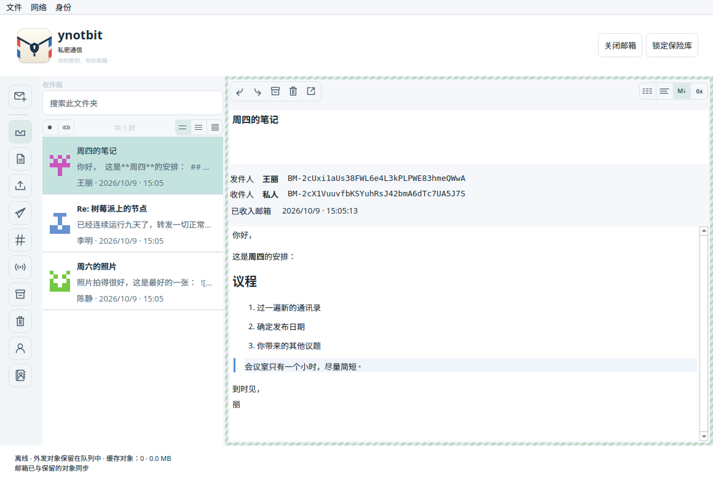
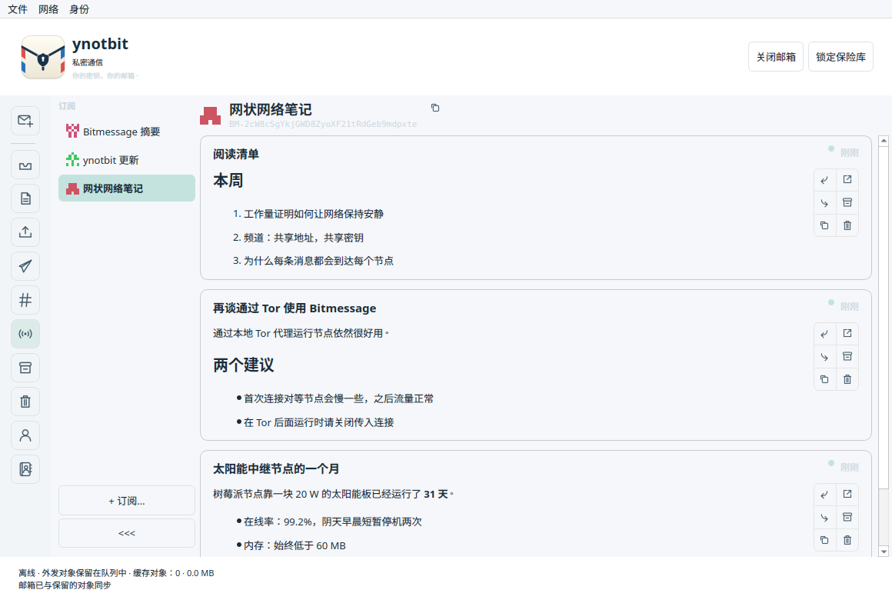
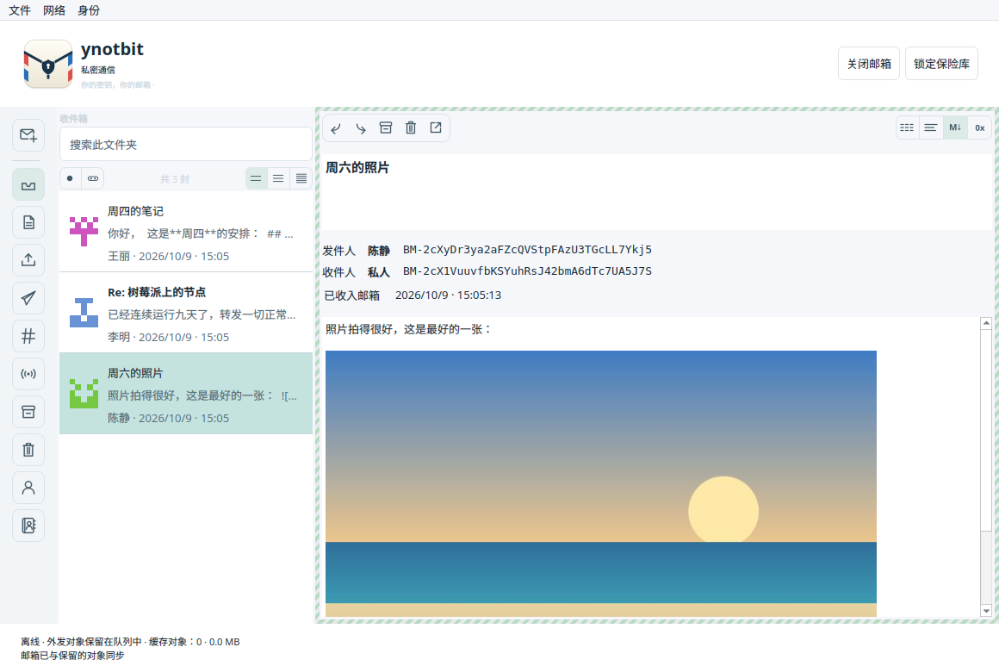
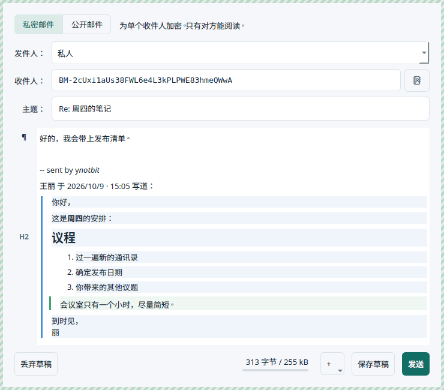
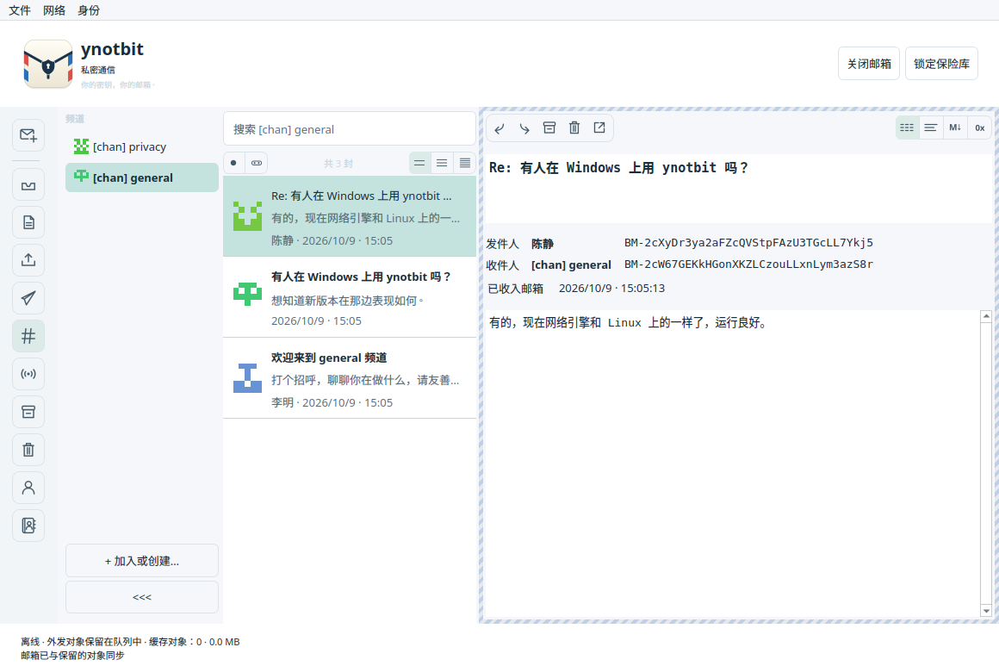
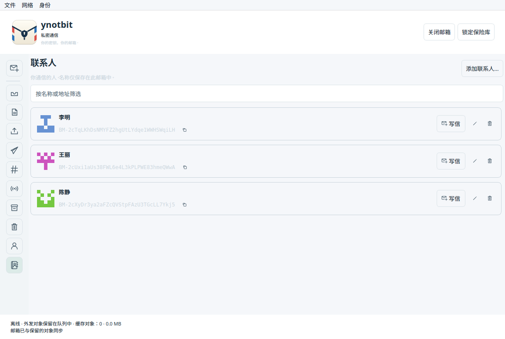
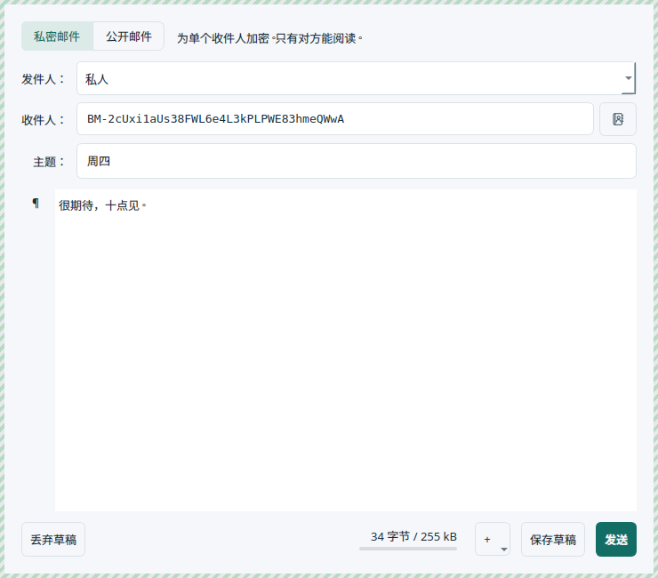

# ynotbit — why not bit?

[English](README.md) | [日本語](README.ja.md) | [한국어](README.ko.md) | **简体中文** | [繁體中文](README.zh-TW.md) | [Русский](README.ru.md) | [Українська](README.uk.md)

一个基于 [notbit](https://github.com/bpeel/notbit) 的小巧桌面 Bitmessage 客户端，
作者 [yshurik](https://github.com/yshurik)。**当前版本：0.6.0**

ynotbit 把身份密钥保存在受密码保护的保险库中，把往来信件保存在另一个加密的邮箱文档中。
不持有密钥的中继在保险库锁定时也会继续收集网络对象。解锁后，它会检查保留下来的对象，
并把发给你的信件保存到邮箱中。



| 订阅 | 信中的图片 | 回复 |
|---|---|---|
|  |  |  |

| 频道 | 联系人 | 给联系人写信 |
|---|---|---|
|  |  |  |

## 下载

[**v0.6.0 版本**](https://github.com/yshurik/ynotbit/releases/tag/v0.6.0)：适用于 Linux（x86_64）、
macOS（Apple Silicon）和 Windows（x86_64）的预编译安装包，均经过 CI 测试。
各个版本能保证什么、不能保证什么，请参阅下方的[当前的局限](#当前的局限)。

如果系统语言是中文，界面会自动显示为中文。也可以在 **设置 → 外观** 中选择（重启后生效）。

## 使用方法

1. 创建或打开一个 `.bmvault` 文件。创建身份、导入 `keys.dat`，或者输入共享口令和预期地址来
   加入频道。
2. 在“文档”等可写的文件夹中创建或打开一个 `.bmmail` 文档。
3. 选择 **写信**，选好发件人，再指定收件人：输入联系人姓名或 BM- 地址，或者使用 **收件人**
   旁边的联系人按钮。所做的更改会自动保存在加密的邮箱中。
4. 选择 **发送**。已保存的草稿带有 **编辑 / 发送** 按钮。
5. 在 **发件箱** 中查看进度。获取密钥和工作量证明可能需要一些时间；收件人的确认是异步到达的，
   并不是已读回执。
6. 用完后锁定保险库。准备工作会暂停，邮箱会关闭，但中继会继续处理已经交给它的加密网络对象。

要给某人起名字，可以点击信中地址旁边的“人像加号”按钮，或者使用 **联系人 → 添加联系人…**。
名字随后会出现在消息列表、阅读窗口和写信窗口中，并且始终和完整地址一起显示。

要关注某个发件人的广播，请打开 **订阅** 并选择 **+ 订阅…**（或 **身份 → 订阅广播…**），
其帖子会以信息流的形式显示。新邮箱默认已经关注 Bitmessage 摘要和 ynotbit 的更新通知。

要在信中加入图片，可以使用写信窗口中的 **+** 按钮或右键菜单，也可以把图片文件拖放到信件上。

**文件 → 备份邮箱和保险库…** 会同时保存这两个文档。请务必两个都保留：只有邮箱无法恢复它的
加密密钥。修改密码不会使旧的保险库副本或备份失效。导入时原来的明文 `keys.dat` 会原样保留。

## 功能

- 便携的保险库：Argon2id（64 MiB，3 轮）和 XChaCha20-Poly1305；受保护的密钥内存分配、修改密码、
  身份名称、确定性的 v3/v4 频道。
- SQLCipher 邮箱：草稿、正文、地址、公钥、投递记录、确认令牌、订阅和检查点全部保持加密。
  已有的 v1 邮箱文档会以事务方式迁移，不会丢失草稿。
- 使用收件人公钥发送；v2/v3/v4 公钥的请求与应答；可取消的后台工作量证明（使用除一个核心外的
  所有 CPU 核心，以及 GPU：macOS 上用 Metal，其他平台用 OpenCL）；持久的发件箱和投递历史。
- 私信解密和发件人验证；确认回执；有次数上限的过期自动重发；手动重发和取消；使用经过验证的
  发件人密钥回复。取消无法撤回已经转发出去的对象。
- 通讯录：联系人可以有只在本邮箱中使用的私密名字，保存在加密邮箱中，永远不会被发送出去。
  可以从任何一封信中一键添加；名字会显示在列表、阅读窗口和写信窗口中（支持按名字补全和
  联系人选择器）；完整地址始终显示在名字旁边。
- 频道有带名称的选择器（加入的频道会像 PyBitmessage 一样命名为 `[chan] <口令>`），消息列表和
  搜索按频道分开，并提供 **向频道发信** 操作。频道列表可以折叠成一列带未读标记的标识图标。
  BM- 地址使用等宽字体，每个地址都有一个 GitHub 风格的标识图标。
- 阅读窗口会按类型（私信、频道内私信、匿名频道帖子、广播）为信件加上不同的边框，并提供纯文本、
  文本、Markdown 和十六进制视图，能自动识别 Markdown 和无法阅读的二进制内容。
- 消息详情会对齐发件人和收件人地址，用颜色标出成功的确认，并显示记录下来的投递过程：已准备、
  已获得密钥、已发送给对等节点、已确认，或已在邮箱中收到。
- 广播发布（v4/v5 对象）和 **订阅**：关注的发件人排成一列，类似频道列表；每位发件人的帖子以卡片
  信息流显示，卡片上可以私下回复、转发、复制文本、在新窗口中打开、归档和移到回收站。新邮箱默认
  关注 Bitmessage 摘要。另有共享频道、在后台运行的文件夹搜索、已读状态、归档、回收站与恢复、
  明确的永久删除。
- 更新通知：来自 ynotbit 发布地址（`BM-2666hf5eAbjCJMaPwC7eG3Um55QJGM`）的签名广播，无需订阅，
  有新版本时会显示横幅；可在 **设置 → 通知** 中关闭。
- 独立进程中的 notbit 中继可在 Linux、macOS 和 Windows 上运行，不会拿到任何保险库或邮箱密钥。
  它向对等节点自称 `/ynotbit:<版本>/`。它用有界的本地队列接收网络对象，验证工作量证明，并记录
  接受、拒绝以及向已连接对等节点提供的情况。接收状态在重启后依然保留。
- 网络对象保存在一个 SQLite 文件 `objects.sqlite` 中：中继负责写入并按保留上限清理，应用负责读取，
  因此新对象会在下一次刷新时进入邮箱。
- 桌面界面使用 Qt Widgets 编写，不使用 QML 或 Qt Quick。自绘的列表最多保留三页、每页 100 条消息
  摘要，只加载所选信件的正文。
- 写信窗口是一个可视化的 Markdown 编辑器。每段旁边的标记（¶、H1–H6、列表、代码）可以像 MarkText
  一样打开 **转换为**。回复会在同一个编辑器中用 `>` 以邮件的方式引用原信：引用的文字可以修改，
  但仍保持引用；阅读窗口用彩色竖条显示引用层级。信件也可以转发。
- Bitmessage 没有附件，所以图片以标准 Markdown `data:` URL 的形式放在信中发送，并缩小到能装进
  一封信。阅读窗口会显示这些图片，也会显示 PyBitmessage 的内嵌图片；只加载 PNG、JPEG、GIF 和
  WebP。显示的消息使用安全的 Markdown 文档，不会读取本地文件或远程图片。外观默认跟随系统配色，
  也可以设为浅色或深色。
- 界面支持英语、简体中文、繁体中文、日语、韩语、俄语和乌克兰语。默认跟随系统语言，也可以在
  **设置 → 外观** 中选择（重启后生效）。日期按所选语言的格式显示。
- 对等节点数量、离线模式、重启节点，以及一个 **文件 → 设置…** 窗口，用来设置额外的对等节点、
  SOCKS5 代理、传入连接、工作量证明、主题和语言；可配置的网络缓存保留期限、最近使用的文档路径
  以及合并备份。

投递状态分为 **已排队 → 正在请求密钥 → 正在准备回执 → 工作量证明 → 等待对等节点 → 等待确认 →
已确认**。广播和频道消息可能在没有收件人回执的情况下以 **已发布** 结束。提供给对等节点并不能证明
每个对等节点或最终收件人都已收到。

## 构建与测试

需要：CMake 3.22+、C++20、Qt 6.8+（Core、Gui、Widgets、Network、Test）、OpenSSL、libsodium、
SQLCipher、pkg-config、Ninja。环回中继测试需要 Python 3。从源码构建固定版本的存储依赖时，还需要
Autoconf、Automake、make 和 Tcl。

```sh
scripts/build-dependencies.sh /absolute/scratch /absolute/deps
export PKG_CONFIG_PATH=/absolute/deps/lib/pkgconfig
cmake -S . -B build -G Ninja \
  -DCMAKE_PREFIX_PATH=/absolute/Qt/6.8.3/macos \
  -DCMAKE_BUILD_TYPE=Release
cmake --build build --parallel 4
ctest --test-dir build --output-on-failure
```

在 Linux 上请使用 Qt 安装中的 `gcc_64` 目录。可执行目标是 `ynotbit`，macOS 上生成 `ynotbit.app`。
测试使用临时文档和环回对等节点，从不使用公共网络中的消息。独立的线路测试数据可以用
`tests/generate_wire_fixtures.py` 和 Python cryptography 50.0.1 重新生成；常规测试不需要这个包。

在 Windows 上使用 MSVC 和 Ninja 构建；通过 [vcpkg](https://github.com/microsoft/vcpkg)
（`vcpkg.json` 清单，`x64-windows` 三元组）获取 OpenSSL、libsodium 和 SQLCipher，代替
`build-dependencies.sh`，并传入 `-DCMAKE_TOOLCHAIN_FILE=<vcpkg>/scripts/buildsystems/vcpkg.cmake`。
三个平台经 CI 验证的完整步骤见 `.github/workflows/release.yml`。

翻译位于 `translations/ynotbit_<lang>.ts`，可以用 Qt Linguist 或任意文本编辑器修改。修改代码中
用户可见的字符串后，运行 `cmake --build build --target update_translations` 更新这些文件；
`scripts/check-translations.py`（同时也是一项测试）在有未翻译条目或 `%1` 占位符损坏时会失败。
存储层和协议层的错误信息由 `scripts/update-error-catalog.py` 收集。

README 的截图来自演示数据，而不是真实的邮箱。先用 `cmake --build build --target readme_screenshots`
构建，再用 `QT_QPA_PLATFORM=offscreen build/readme_screenshots docs/images` 重新生成；带中文演示
信件的简体中文版用 `... docs/images/zh_CN zh_CN` 生成。

要打包一个附带 Qt 运行库、可以分发的版本：

```sh
# macOS
scripts/package-macos.sh /absolute/build /absolute/ynotbit-macos-arm64.zip /absolute/Qt/6.8.3/macos
# Linux — 用 linuxdeploy 生成一个自包含的 AppImage
scripts/package-linux.sh /absolute/build /absolute/ynotbit-x86_64.AppImage /absolute/Qt/6.8.3/gcc_64
```
```powershell
# Windows
scripts/package-windows.ps1 -BuildDir C:\absolute\build -OutputZip C:\absolute\ynotbit-windows-x86_64.zip `
  -QtBinDir C:\absolute\Qt\6.8.3\msvc2022_64\bin -VcpkgBinDir C:\absolute\build\vcpkg_installed\x64-windows\bin
```

## 文档、网络数据与可移植性

保险库和邮箱文档可以放在任何你喜欢的位置。节点和缓存目录使用 Qt 的应用数据位置。为了兼容早期
alpha 版本的缓存，内部应用标识仍为 `NotbitDesktop/Notbit Desktop`。`--data-dir /absolute/path`
可以指定节点目录。`--portable` 使用相对于启动目录的 `./notbit-data/node`。`--offline` 启动时
不连接网络。应用退出时中继也会停止。

网络数据默认保留 2 GiB / 90 天，由中继在节点目录的 `objects.sqlite` 中管理；可在 **设置 → 存储**
中修改。本地保留的时间可以长于协议规定的过期时间，以便以后解锁后再检查。丢弃保留的对象可能导致
以后无法恢复，但已经保存到邮箱中的信件不受影响。工作量证明使用除一个核心外的所有 CPU 核心，
有 GPU 时也会使用 GPU；设置 `YNOTBIT_NO_GPU=1` 则只用 CPU。

## 当前的局限

这仍是开发中的软件。本地测试覆盖了文档迁移、格式错误的对象、协议测试数据、真实的工作量证明、
控制器投递、锁定与重新打开、桌面操作，以及通过真实环回中继的发布。这既不是独立的安全审计，
也不是公共网络互操作性的认证。锁定会释放受保护的密钥并关闭访问，但不能保证 Qt 或操作系统中已
显示明文的副本会从内存、交换区、崩溃转储或截图中全部清除。

macOS 安装包面向 **Apple Silicon、macOS 15.6 及以上**，并自带运行时依赖。它只有临时（ad-hoc）
签名，没有 Developer ID 签名，也没有经过公证。从 0.5.0 起，Windows 版也通过一个小的 Winsock 层
（`third_party/notbit/src/ntb-win32.c`）运行 notbit 引擎。Windows 上没有能让应用干净地停止节点的
信号，所以退出时节点会被强制终止，存储层已排队但尚未写入的工作会丢失。Linux 下载是一个 AppImage。
附件（放在信中发送的图片除外）以及 CPU 并行度设置尚未实现。

`.github/workflows/release.yml` 会在每次推送 `v*` 标签（或手动触发）时构建、测试并打包 Linux、
macOS 和 Windows 版本，然后把三个压缩包附加到 GitHub Release。`docs/ci/build.yml` 是一个较旧、
未使用的轻量持续构建与测试工作流模板（每次推送和 PR，不打包），尚未接入 `.github/workflows/`。

另请参阅[验证](docs/verification.md)、[架构](docs/design.md)、
[实现计划](docs/superpowers/plans/2026-09-13-complete-messaging.md)和
[第三方署名](THIRD_PARTY.md)（均为英文）。ynotbit 自身的代码采用 MIT 许可证；随附的组件
保留各自的许可证。
