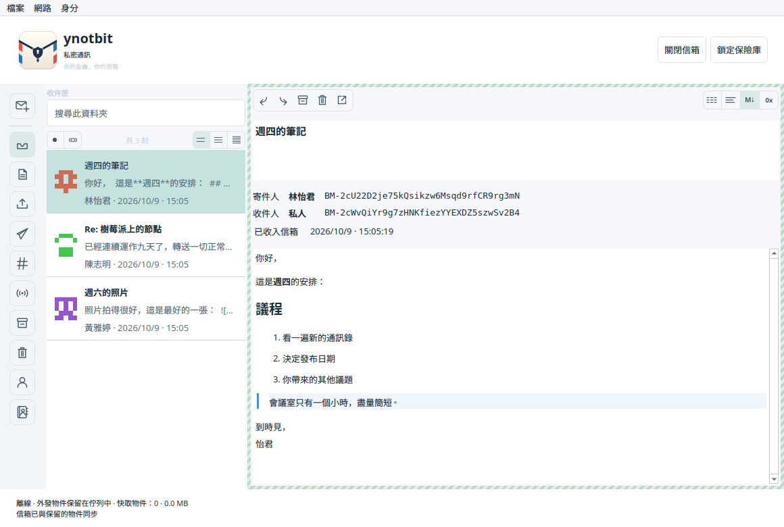
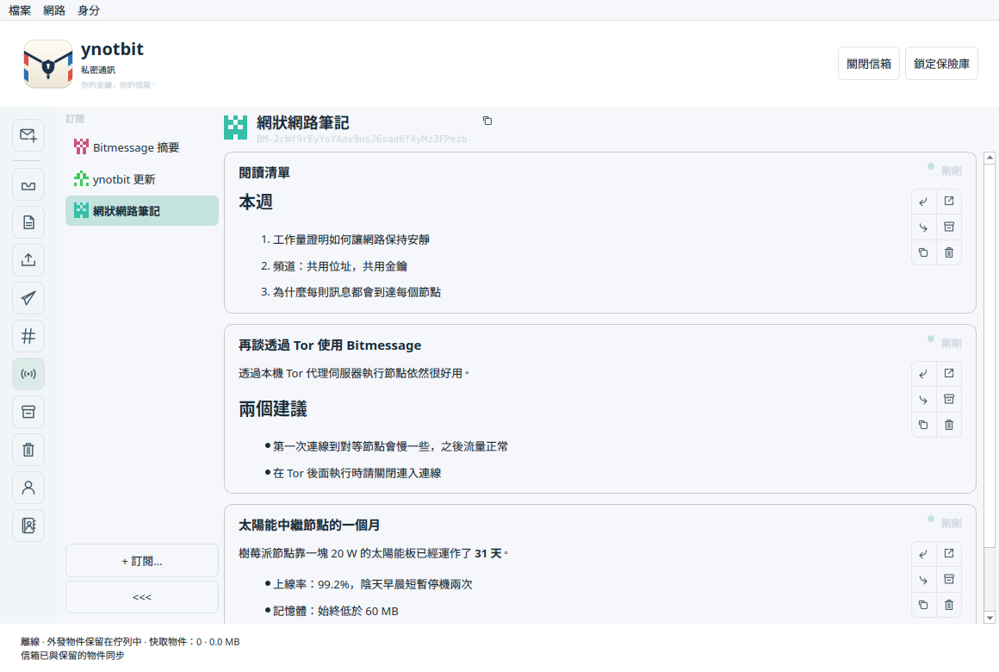
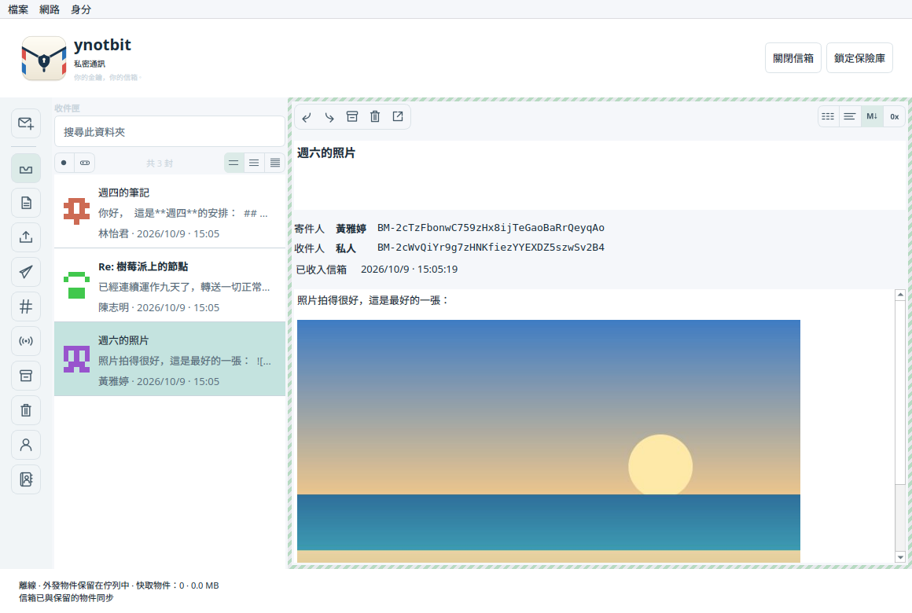
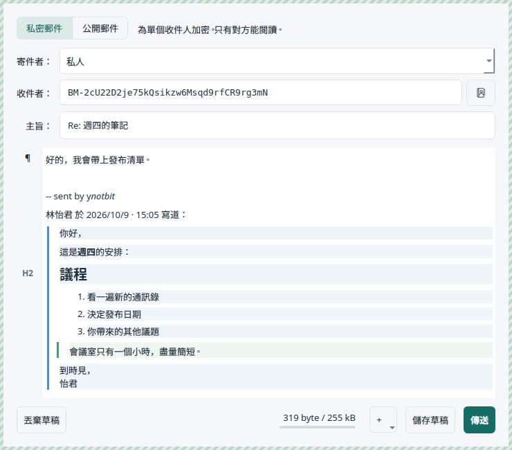
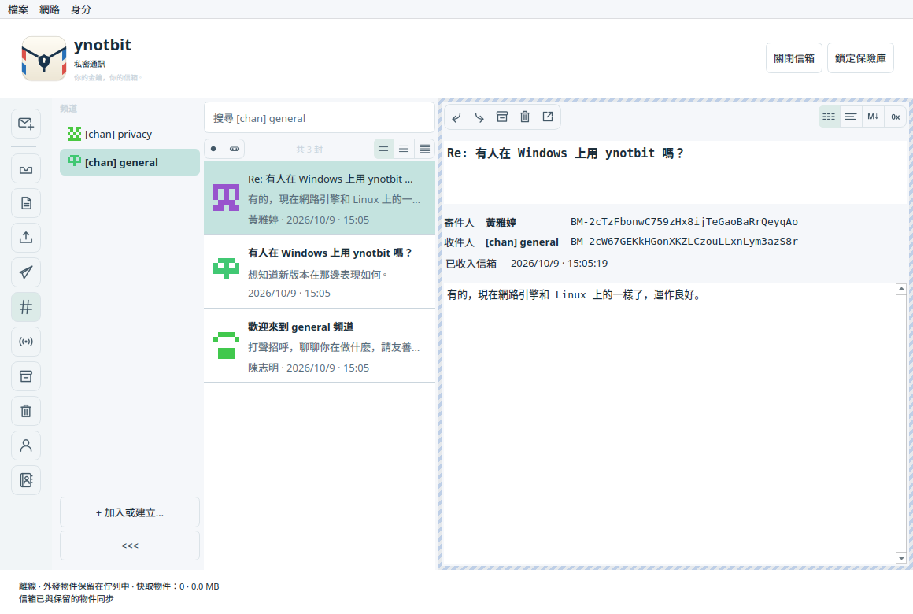
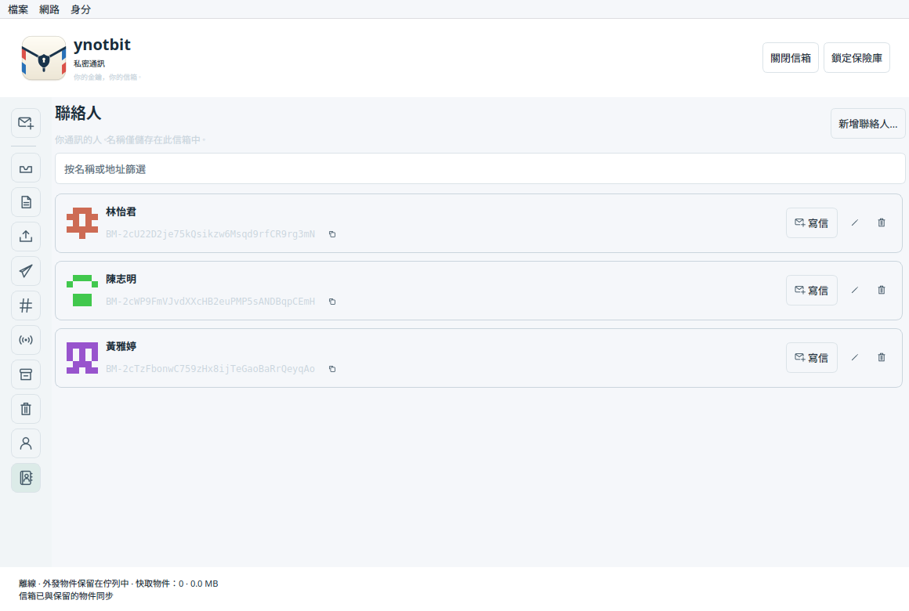
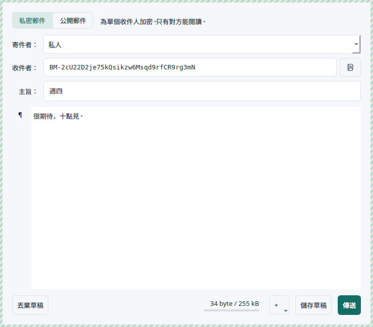

# ynotbit — why not bit?

[English](README.md) | [日本語](README.ja.md) | [한국어](README.ko.md) | [简体中文](README.zh-CN.md) | **繁體中文** | [Русский](README.ru.md) | [Українська](README.uk.md)

一個以 [notbit](https://github.com/bpeel/notbit) 為基礎的輕巧桌面 Bitmessage 用戶端，
作者 [yshurik](https://github.com/yshurik)。**目前版本：0.6.0**

ynotbit 把身分金鑰存放在受密碼保護的保險庫中，把往來信件存放在另一個加密的信箱文件中。
不持有金鑰的中繼在保險庫鎖定時也會繼續收集網路物件。解鎖後，它會檢查保留下來的物件，
並把寄給你的信件存進信箱。



| 訂閱 | 信中的圖片 | 回覆 |
|---|---|---|
|  |  |  |

| 頻道 | 聯絡人 | 寫信給聯絡人 |
|---|---|---|
|  |  |  |

## 下載

[**v0.6.0 版本**](https://github.com/yshurik/ynotbit/releases/tag/v0.6.0)：適用於 Linux（x86_64）、
macOS（Apple Silicon）和 Windows（x86_64）的預先建置套件，皆經過 CI 測試。
各個版本能保證什麼、不能保證什麼，請參閱下方的[目前的限制](#目前的限制)。

如果系統語言是中文，介面會自動顯示為中文。也可以在 **設定 → 外觀** 中選擇（重新啟動後生效）。

## 使用方式

1. 建立或開啟一個 `.bmvault` 檔案。建立身分、匯入 `keys.dat`，或輸入共用通關語和預期位址來
   加入頻道。
2. 在「文件」等可寫入的資料夾中建立或開啟一個 `.bmmail` 文件。
3. 選擇 **寫信**，選好寄件人，再指定收件人：輸入聯絡人名稱或 BM- 位址，或使用 **收件人** 旁邊的
   聯絡人按鈕。所做的變更會自動儲存在加密的信箱中。
4. 選擇 **傳送**。已儲存的草稿有 **編輯 / 傳送** 按鈕。
5. 在 **寄件匣** 中查看進度。取得金鑰和工作量證明可能需要一些時間；收件人的確認是非同步送達的，
   並不是已讀回條。
6. 用完後鎖定保險庫。準備工作會暫停，信箱會關閉，但中繼會繼續處理已經交給它的加密網路物件。

要幫某人取名字，可以點選信中位址旁邊的「人像加號」按鈕，或使用 **聯絡人 → 新增聯絡人…**。
名字之後會出現在訊息清單、閱讀視窗和寫信視窗中，而且一律和完整位址一起顯示。

要關注某位寄件人的廣播，請開啟 **訂閱** 並選擇 **+ 訂閱…**（或 **身分 → 訂閱廣播…**），
其貼文會以動態的形式顯示。新信箱預設已經關注 Bitmessage 摘要和 ynotbit 的更新通知。

要在信中加入圖片，可以使用寫信視窗中的 **+** 按鈕或右鍵選單，也可以把圖片檔案拖放到信件上。

**檔案 → 備份信箱和保險庫…** 會同時儲存這兩個文件。請務必兩個都保留：只有信箱無法復原它的
加密金鑰。變更密碼不會使舊的保險庫副本或備份失效。匯入時原本的明文 `keys.dat` 會原封不動地保留。

## 功能

- 可攜的保險庫：Argon2id（64 MiB，3 輪）和 XChaCha20-Poly1305；受保護的金鑰記憶體配置、變更密碼、
  身分名稱、確定性的 v3/v4 頻道。
- SQLCipher 信箱：草稿、內文、位址、公鑰、遞送紀錄、確認權杖、訂閱和檢查點全部維持加密。
  既有的 v1 信箱文件會以交易方式移轉，不會遺失草稿。
- 使用收件人公鑰傳送；v2/v3/v4 公鑰的請求與回應；可取消的背景工作量證明（使用除了一個核心以外的
  所有 CPU 核心，以及 GPU：macOS 上用 Metal，其他平台用 OpenCL）；持久的寄件匣和遞送紀錄。
- 私訊解密和寄件人驗證；確認回條；有次數上限的到期自動重送；手動重送和取消；使用經過驗證的
  寄件人金鑰回覆。取消無法收回已經轉送出去的物件。
- 通訊錄：聯絡人可以有只在這個信箱中使用的私人名稱，儲存在加密信箱裡，絕不會被傳送出去。
  可以從任何一封信一鍵新增；名稱會顯示在清單、閱讀視窗和寫信視窗中（支援依名稱自動完成和
  聯絡人選擇器）；完整位址一律顯示在名稱旁邊。
- 頻道有附名稱的選擇器（加入的頻道會像 PyBitmessage 一樣命名為 `[chan] <通關語>`），訊息清單和
  搜尋依頻道分開，並提供 **向頻道發信** 動作。頻道清單可以收合成一欄帶未讀標記的識別圖示。
  BM- 位址使用等寬字型，每個位址都有一個 GitHub 風格的識別圖示。
- 閱讀視窗會依類型（私訊、頻道內私訊、匿名頻道貼文、廣播）為信件加上不同的外框，並提供純文字、
  文字、Markdown 和十六進位檢視，能自動辨識 Markdown 和無法閱讀的二進位內容。
- 訊息詳細資料會對齊寄件人和收件人位址，用顏色標示成功的確認，並顯示記錄下來的遞送過程：已準備、
  已取得金鑰、已傳送給對等節點、已確認，或已在信箱中收到。
- 廣播發布（v4/v5 物件）和 **訂閱**：關注的寄件人排成一欄，類似頻道清單；每位寄件人的貼文以卡片
  動態顯示，卡片上可以私下回覆、轉寄、複製文字、在新視窗中開啟、封存和移到垃圾桶。新信箱預設
  關注 Bitmessage 摘要。另有共用頻道、在背景執行的資料夾搜尋、已讀狀態、封存、垃圾桶與還原、
  明確的永久刪除。
- 更新通知：來自 ynotbit 發布位址（`BM-2666hf5eAbjCJMaPwC7eG3Um55QJGM`）的簽章廣播，不必訂閱，
  有新版本時會顯示橫幅；可在 **設定 → 通知** 中關閉。
- 獨立行程中的 notbit 中繼可在 Linux、macOS 和 Windows 上執行，不會拿到任何保險庫或信箱金鑰。
  它向對等節點自稱 `/ynotbit:<版本>/`。它以有上限的本機佇列接收網路物件，驗證工作量證明，並記錄
  接受、拒絕以及提供給已連線對等節點的情況。接收狀態在重新啟動後依然保留。
- 網路物件存放在一個 SQLite 檔案 `objects.sqlite` 中：中繼負責寫入並依保留上限清理，應用程式負責
  讀取，因此新物件會在下一次重新整理時進入信箱。
- 桌面介面使用 Qt Widgets 撰寫，不使用 QML 或 Qt Quick。自行繪製的清單最多保留三頁、每頁 100 則
  訊息摘要，只載入所選信件的內文。
- 寫信視窗是一個視覺化的 Markdown 編輯器。每段旁邊的標記（¶、H1–H6、清單、程式碼）可以像
  MarkText 一樣開啟 **轉換為**。回覆會在同一個編輯器中用 `>` 以電子郵件的方式引用原信：引用的
  文字可以修改，但仍維持引用；閱讀視窗以彩色豎條顯示引用層級。信件也可以轉寄。
- Bitmessage 沒有附件，所以圖片以標準 Markdown `data:` URL 的形式放在信中傳送，並縮小到能放進
  一封信。閱讀視窗會顯示這些圖片，也會顯示 PyBitmessage 的內嵌圖片；只載入 PNG、JPEG、GIF 和
  WebP。顯示的訊息使用安全的 Markdown 文件，不會讀取本機檔案或遠端圖片。外觀預設跟隨系統配色，
  也可以設為淺色或深色。
- 介面支援英文、簡體中文、繁體中文、日文、韓文、俄文和烏克蘭文。預設跟隨系統語言，也可以在
  **設定 → 外觀** 中選擇（重新啟動後生效）。日期依所選語言的格式顯示。
- 對等節點數量、離線模式、重新啟動節點，以及一個 **檔案 → 設定…** 視窗，用來設定額外的對等節點、
  SOCKS5 代理伺服器、連入連線、工作量證明、主題和語言；可設定的網路快取保留期限、最近使用的文件
  路徑以及合併備份。

遞送狀態分為 **已排隊 → 正在請求金鑰 → 正在準備回執 → 工作量證明 → 等待對等節點 → 等待確認 →
已確認**。廣播和頻道訊息可能在沒有收件人回執的情況下以 **已發布** 結束。提供給對等節點並不能證明
每個對等節點或最終收件人都已收到。

## 建置與測試

需要：CMake 3.22+、C++20、Qt 6.8+（Core、Gui、Widgets、Network、Test）、OpenSSL、libsodium、
SQLCipher、pkg-config、Ninja。迴路中繼測試需要 Python 3。從原始碼建置固定版本的儲存相依套件時，
還需要 Autoconf、Automake、make 和 Tcl。

```sh
scripts/build-dependencies.sh /absolute/scratch /absolute/deps
export PKG_CONFIG_PATH=/absolute/deps/lib/pkgconfig
cmake -S . -B build -G Ninja \
  -DCMAKE_PREFIX_PATH=/absolute/Qt/6.8.3/macos \
  -DCMAKE_BUILD_TYPE=Release
cmake --build build --parallel 4
ctest --test-dir build --output-on-failure
```

在 Linux 上請使用 Qt 安裝中的 `gcc_64` 目錄。執行檔目標是 `ynotbit`，macOS 上會產生 `ynotbit.app`。
測試使用暫存文件和迴路對等節點，從不使用公開網路中的訊息。獨立的線路測試資料可以用
`tests/generate_wire_fixtures.py` 和 Python cryptography 50.0.1 重新產生；一般測試不需要這個套件。

在 Windows 上使用 MSVC 和 Ninja 建置；透過 [vcpkg](https://github.com/microsoft/vcpkg)
（`vcpkg.json` 資訊清單，`x64-windows` 三元組）取得 OpenSSL、libsodium 和 SQLCipher，取代
`build-dependencies.sh`，並傳入 `-DCMAKE_TOOLCHAIN_FILE=<vcpkg>/scripts/buildsystems/vcpkg.cmake`。
三個平台經 CI 驗證的完整步驟請見 `.github/workflows/release.yml`。

翻譯位於 `translations/ynotbit_<lang>.ts`，可以用 Qt Linguist 或任何文字編輯器修改。修改程式碼中
使用者看得到的字串後，執行 `cmake --build build --target update_translations` 更新這些檔案；
`scripts/check-translations.py`（同時也是一項測試）在有未翻譯項目或 `%1` 預留位置損壞時會失敗。
儲存層和協定層的錯誤訊息由 `scripts/update-error-catalog.py` 收集。

README 的截圖來自示範資料，而不是真實的信箱。先用 `cmake --build build --target readme_screenshots`
建置，再用 `QT_QPA_PLATFORM=offscreen build/readme_screenshots docs/images` 重新產生；附中文示範
信件的繁體中文版用 `... docs/images/zh_TW zh_TW` 產生。

要封裝一個附帶 Qt 執行階段程式庫、可以散布的版本：

```sh
# macOS
scripts/package-macos.sh /absolute/build /absolute/ynotbit-macos-arm64.zip /absolute/Qt/6.8.3/macos
# Linux — 用 linuxdeploy 產生一個自給自足的 AppImage
scripts/package-linux.sh /absolute/build /absolute/ynotbit-x86_64.AppImage /absolute/Qt/6.8.3/gcc_64
```
```powershell
# Windows
scripts/package-windows.ps1 -BuildDir C:\absolute\build -OutputZip C:\absolute\ynotbit-windows-x86_64.zip `
  -QtBinDir C:\absolute\Qt\6.8.3\msvc2022_64\bin -VcpkgBinDir C:\absolute\build\vcpkg_installed\x64-windows\bin
```

## 文件、網路資料與可攜性

保險庫和信箱文件可以放在任何你喜歡的位置。節點和快取目錄使用 Qt 的應用程式資料位置。為了相容
早期 alpha 版本的快取，內部應用程式識別碼仍為 `NotbitDesktop/Notbit Desktop`。
`--data-dir /absolute/path` 可以指定節點目錄。`--portable` 使用相對於啟動目錄的
`./notbit-data/node`。`--offline` 啟動時不連線網路。應用程式結束時中繼也會停止。

網路資料預設保留 2 GiB / 90 天，由中繼在節點目錄的 `objects.sqlite` 中管理；可在
**設定 → 儲存空間** 中修改。本機保留的時間可以比協定規定的到期時間更長，以便之後解鎖再檢查。
丟棄保留的物件可能導致之後無法復原，但已經存進信箱的信件不受影響。工作量證明使用除了一個核心
以外的所有 CPU 核心，有 GPU 時也會使用 GPU；設定 `YNOTBIT_NO_GPU=1` 則只用 CPU。

## 目前的限制

這仍是開發中的軟體。本機測試涵蓋文件移轉、格式錯誤的物件、協定測試資料、真實的工作量證明、
控制器遞送、鎖定與重新開啟、桌面操作，以及透過真實迴路中繼的發布。這既不是獨立的安全稽核，
也不是公開網路互通性的認證。鎖定會釋放受保護的金鑰並關閉存取，但無法保證 Qt 或作業系統中
已顯示明文的副本會從記憶體、置換空間、當機傾印或截圖中全部清除。

macOS 套件以 **Apple Silicon、macOS 15.6 以上** 為對象，並內含執行階段相依套件。它只有臨時
（ad-hoc）簽章，沒有 Developer ID 簽章，也沒有經過公證。從 0.5.0 起，Windows 版也透過一個小型
Winsock 層（`third_party/notbit/src/ntb-win32.c`）執行 notbit 引擎。Windows 沒有能讓應用程式乾淨地
停止節點的訊號，所以結束時節點會被強制終止，儲存層已排入佇列但尚未寫入的工作會遺失。Linux 下載
是一個 AppImage。附件（放在信中傳送的圖片除外）以及 CPU 平行度設定尚未實作。

`.github/workflows/release.yml` 會在每次推送 `v*` 標籤（或手動觸發）時建置、測試並封裝 Linux、
macOS 和 Windows 版本，然後把三個壓縮檔附加到 GitHub Release。`docs/ci/build.yml` 是一個較舊、
未使用的輕量持續建置與測試工作流程範本（每次推送和 PR，不封裝），尚未接入 `.github/workflows/`。

另請參閱[驗證](docs/verification.md)、[架構](docs/design.md)、
[實作計畫](docs/superpowers/plans/2026-09-13-complete-messaging.md)和
[第三方姓名標示](THIRD_PARTY.md)（皆為英文）。ynotbit 本身的程式碼採用 MIT 授權；隨附的元件
保留各自的授權。
